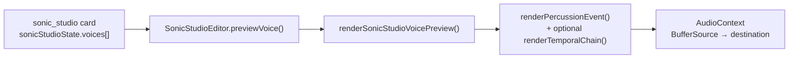
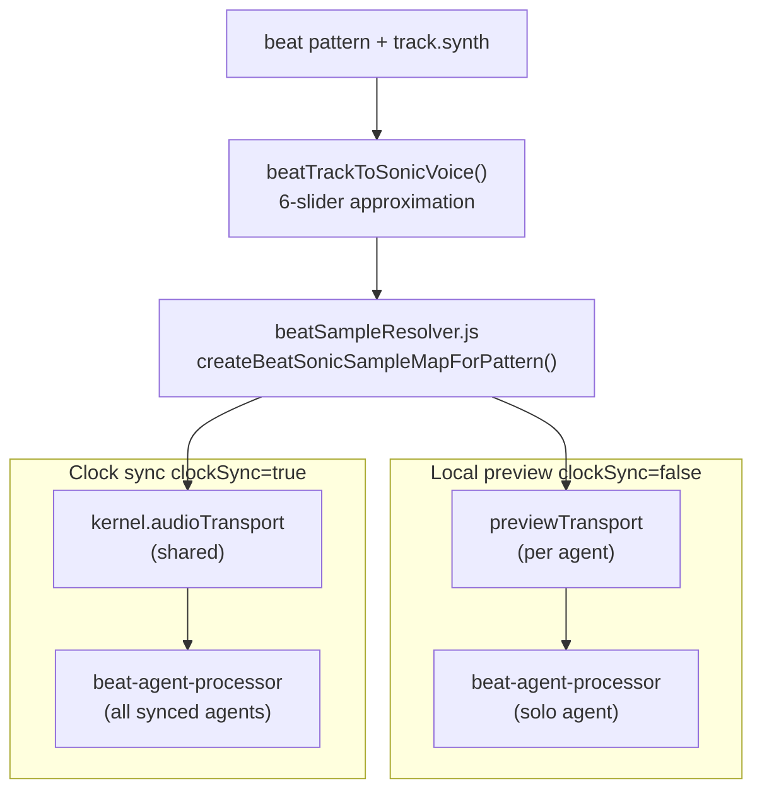

# Sonic Studio ↔ Beat Agent Audio Review
**Version:** v1.2  
**Date:** 2026-07-11  
**Status:** Architecture review / integration reference (updated after pocket + glitch schedule integration)  
**Depends on:** `Specs/Beat Agent and Sonic Studio/sonic_studio_spec.md`, `Specs/Beat Agent and Sonic Studio/Canvas_Music_Framework_Beat_Agent_MVP_Spec_v2.md`, `Specs/Beat Agent and Sonic Studio/Canvas_Sonic_Sketches_Full_Spec_v9.md`, `Specs/Beat Agent and Sonic Studio/canvas_beat_agent_pocket_engine_spec.md`, `Specs/Beat Agent and Sonic Studio/canvas_beat_agent_glitch_engine_spec.md`

---

# 0. Purpose

This document records the **current implementation status** of the Sonic Studio audio engine and the Beat Agent playback stack, what they already share, where they are disconnected, and the **integration surfaces** where Sonic Studio sounds could eventually play through beat agents.

It does **not** choose a linking model (card reference vs project voice library vs inline copy). That decision is deferred until product requirements for fidelity and invalidation are confirmed.

---

# 1. Executive summary

Sonic Studio and Beat Agents **already share the same synthesis library** (`@canvas/sonic-core`), but they use **different voice-resolution paths** and **separate runtimes**. Beat agents never read Sonic Studio card state today. Sounds reach beat playback only through a simplified `track.synth` → `beatTrackToSonicVoice()` mapping, not through Sonic Studio's full voice models.

There is **no live audio bus** between artifacts. Beat playback uses **offline-rendered `Float32Array` buffers** baked into `beat-agent-processor` via `MusicAudioTransportService` (both local preview and clock sync).

**Bottom line:** Playback plumbing is unified on the worklet path with **pocket + glitch schedule expansion** before the processor. The **voice-resolution bridge** to full Sonic Studio voices is still deferred (Surface A spike). **Offline render parity** for expanded glitch schedules needs verification.

---

# 2. Sonic Studio audio engine — current status

## 2.1 Shipped capabilities

| Layer | Location | Status |
|---|---|---|
| Core synthesis | `canvas/packages/sonic-core/` | Shipped — exciter → modal/comb resonator → limiter |
| Voice model | `canvas/packages/sonic-core/src/types/models.js` | Shipped — body, material, contact, gesture, exciter, resonator, output |
| Percussion render | `percussionKernel.js`, `renderSonicEvent.js` | Shipped |
| Temporal FX (offline) | `temporal/temporalRenderers.js` | Shipped in core; used in Sonic Studio preview when `engineState.temporal.enabled` |
| Engine / card state | `studio/sonicStudioState.js`, `sonicStudio/domain/sonicStudioCard.js` | Shipped — `sonicStudioState.voices[]`, hash, save points, morph |
| UI / preview | `SonicStudioEditor.jsx`, `sonicStudioAudition.js` | Shipped — one-shot preview via local `AudioContext` + `BufferSource` |
| Card integration | `CardPreview.jsx`, `ModalContent.jsx`, `useCanvasDocument.js` | Shipped — `sonic_studio` artifact type |

## 2.2 Spec-deferred / not built

| Layer | Spec reference | Status |
|---|---|---|
| Real-time DSP graph | `Specs/Beat Agent and Sonic Studio/sonic_studio_spec.md` §2 (`SonicStudioBridge.ts`) | Not built |
| Live audio graph ownership inside Sonic Studio | `sonic_studio_spec.md` §3.1 | Not built — Canvas calls core offline only |
| Rendered asset pipeline | `sonicRenderedAssets` on card | Schema only — field exists but is not populated with playable buffers |
| Effects UI | `engineState.effects[]` | Defined in state; no editor or runtime consumer in Sonic Studio |
| Modulation UI | `engineState.modulation.lanes[]` | Defined in state; no editor or runtime consumer |
| Temporal UI | `engineState.temporal` | Used in offline preview when enabled; not editable in Sonic Studio editor |
| Sequenced / transport playback | — | Not in scope for Sonic Studio card |
| Package split (`sonic-ui`, `sonic-agent`, `sonic-presets`) | `sonic_studio_spec.md` §2 | Monolithic — core in package, UI in `features/sonicStudio/` |

## 2.3 Sonic Studio playback flow (today)

```text
sonic_studio card (sonicStudioState.voices[])
  → SonicStudioEditor.previewVoice()
  → renderSonicStudioVoicePreview()          [sonicStudioAudition.js]
      → renderPercussionEvent()              [percussionKernel.js]
      → renderTemporalChain() (if temporal.enabled)
  → AudioContext.createBufferSource()
  → destination
```



**Key behavior:** Sonic Studio is an **offline synthesizer + parameter editor**. Preview renders one voice at a time and plays it once. There is no sequencer, no multi-voice mix bus, and no connection to Music transport.

## 2.4 Default voice origin

Sonic Studio default kit uses `createDefaultPercussionKit()` from `percussionPresets.js` via `createDefaultSonicStudioState()` in `sonicStudioCard.js`. Default voices: kick, snare, hat, cymbal — same archetypes beat agents target, but stored as **full `SonicVoiceState` trees**, not beat synth sliders.

---

# 3. Beat Agent audio engine — current status

## 3.1 Shipped capabilities

| Layer | Location | Status |
|---|---|---|
| Runtime orchestrator | `music/agents/beat/hooks/useBeatAgentRuntime.js` | Shipped — per-agent preview transport + shared clock-sync transport |
| Worklet playback (all modes) | `music/transport/MusicAudioTransportService.js` | Shipped — async agent registration, pending message queue, per-track postMessage retry |
| Per-agent local preview | `music/agents/beat/domain/beatPreviewTransport.js` | Shipped — isolated `MusicAudioTransportService` per runtime entry when `clockSync: false` |
| Worklet mixer | `public/audio-worklets/beat-agent-processor.js` | Shipped — step clock, pre-baked samples, mix-bus soft limiter, voice fade-out |
| Sample resolution | `music/agents/beat/domain/beatSampleResolver.js` | Shipped — shared `renderBeatTrackSample()` for payload build |
| Payload / session helpers | `music/agents/beat/domain/beatClockSync.js` | Shipped — `startBeatWorkletSession`, `updateBeatWorkletAgent`, payload cache with sample rate |
| Offline artifact analysis | `music/agents/beat/domain/analyzeAudioArtifacts.js` | Shipped — Vitest click/clip/silence detection |
| Local playback engine (legacy) | `music/agents/beat/engine/BeatEngine.js` | Retained for **temporal FX bus only** in fullscreen — no longer drives sequenced beat hits |
| Temporal FX send | `temporal-delay-processor.js` + BeatEngine send bus | Shipped on beat fullscreen path only |
| Pattern / track state | `beatAgentState.js`, `music-core/patterns/beatPattern.js` | Shipped — kick/snare/hat/clap + 16-step grid; **`pocket`** + **`glitch`** state normalized on load |
| Pocket Engine | `domain/pocket/PocketEngine.js` | Shipped (2026-07-11) — role timing, swing, accent, seeded variation → `pocketSchedule` |
| Glitch Engine | `domain/glitch/GlitchEngine.js` | Shipped (2026-07-11) — phrase-block mutations (stutter, ratchet, dropout, repeat, pitch, gate) |
| Pocket / Glitch UI | `BeatAgentFullscreen.jsx` | Shipped — `PocketPanel`, `GlitchPanel`, schedule previews |
| Track synth sliders | `beatTrackSynth.js` | Shipped — gain, attackMs, decayMs, pitch, tone, distortion |
| Sonic-core integration | `sonic-core/integration/beatAdapter.js` | Shipped — simplified mapping only |
| Sonic sketch metadata | `BeatAgentFullscreen.jsx`, `musicApi.js` | Shipped — descriptor/space/temporal state via sketch APIs |
| Music kernel | `MusicKernel.js`, `MusicKernelProvider.jsx` | Shipped — owns shared `AudioEngine` + transport |
| Card lifecycle | `useCanvasDocument.handleSaveNewBeatAgent` | Shipped |

## 3.2 Spec-deferred / partial

| Layer | Status |
|---|---|
| AgentRegistry plugin model for beat agents | Registry exists; beat agents register on audio transport directly |
| MusicEventBus beat publishing | Event bus exists; beat agents do not publish/subscribe today |
| Canvas chat agent / MCP beat control | No connection |
| Sample file loading | Tracks use `filePath: 'generated://kick'` placeholders; sound is procedural |
| NL agent beat editing | `beatAi.js` — JSON patch for `/pattern/`, `/pocket/`, `/glitch/` only |
| Pocket/glitch offline render parity | Live worklet uses `pocketSchedule`; Sonic Core offline path should match — **verify** |
| Glitch Phase 2 sonic overrides | Per-trigger filter/tone/material fields spec'd; not wired to voices |
| Voice-to-MIDI / cross-agent routing | Spec'd in Beat Agent MVP; not built |

## 3.3 Playback transport (v1.1 — unified worklet)

Beat agents **always** play through `beat-agent-processor`. The `clockSync` flag selects **which transport instance** drives the clock, not which audio engine renders hits.

### Path A — Local preview (`clockSync: false`)

```text
useBeatAgentRuntime()
  → ensureBeatPreviewTransport(entry, kernel.audioEngine)   [one transport per agent card]
  → startBeatWorkletSession(entry, previewTransport, runtimeKey, state)
  → buildBeatAgentAudioPayload() → createBeatSonicSampleMapForPattern()
  → previewTransport.registerBeatAgent(payload)
  → previewTransport.play() / stop()                        [independent per card]
  → beat-agent-processor (single agent) → softLimitMix → destination
```

- Each beat agent card owns a **dedicated** `MusicAudioTransportService` + worklet node (shared `AudioEngine` / `AudioContext`).
- Play/stop on one card does **not** stop other cards.
- Transport UI (playhead, isPlaying) reads from the card's preview transport state.

### Path B — Project clock sync (`clockSync: true`)

```text
useBeatAgentRuntime()
  → kernel.audioTransport (shared MusicAudioTransportService)
  → startBeatWorkletSession(entry, sharedTransport, runtimeKey, state)
  → buildBeatAgentAudioPayload() with AudioContext sample rate
  → sharedTransport.registerBeatAgent(payload)
  → sharedTransport.play() / stop()                         [project-wide]
  → beat-agent-processor (all synced agents) → softLimitMix → destination
```

- Multiple clock-synced agents register on the **same** transport/worklet.
- `MusicAudioTransportService` queues messages before worklet init; retries `postMessage` per track on clone failure.
- Sample rate resolved from `AudioContext`, not hardcoded.



### Retired path (pre-v1.1)

Local preview previously routed through `MusicTransport.onStep` → `BeatEngine.playStep()` → `BufferSource`. This path was removed due to crackling and transport coupling. `BeatEngine` remains for temporal send in fullscreen only.

## 3.4 Sonic-core sample resolution (beat path today)

All beat audio synthesis flows through `beatAdapter.js`:

| Function | Role |
|---|---|
| `beatTrackToSonicVoice(track, role)` | Maps 6 synth sliders → `createPercussionPreset()` |
| `renderBeatTrackSample(track, opts)` | Renders one track hit via `renderPercussionEvent()` |
| `createBeatSonicSampleMap(pattern)` | Pre-renders all tracks for worklet payload |
| `beatPatternToPercussionEvents(pattern)` | Converts step grid → timed percussion events (offline batch) |
| `renderBeatPatternWithSonicCore(...)` | Full offline pattern render (not used in live beat playback today) |

Role → archetype mapping: `kick` → kick, `hat` → hat, `cymbal`/`ride` → cymbal, default → snare. **`clap` maps to snare archetype.**

Touch points for payload build:
- All playback: `buildBeatAgentAudioPayload()` → `createBeatSonicSampleMapForPattern()` via `beatSampleResolver.js`
- Sample rate: `resolveBeatAudioSampleRate(universalTransport)` from `AudioContext`

---

# 4. Shared vs disconnected

## 4.1 Already shared

| Shared element | Detail |
|---|---|
| Package | `@canvas/sonic-core` used by both subsystems |
| Default kit origin | Both can originate from `createDefaultPercussionKit()` |
| Render primitive | `renderPercussionEvent()` |
| Offline output shape | `{ left: Float32Array, right: Float32Array }` (+ optional stats) |
| Archetypes | kick, snare, hat, cymbal percussion family |
| Sonic sketches | Beat Agent fullscreen loads/persists sketch metadata (`fetchSketchForAgent`, `saveSonicSketch`) — **state only**, not audio routing |

## 4.2 Not connected

| Gap | Detail |
|---|---|
| No Sonic Studio card consumption | Beat runtime has zero references to `sonic_studio` cards, `sonicStudioState`, or `sonicSourceStateHash` |
| Different voice resolution | Beat: 6 synth sliders → coarse `beatTrackToSonicVoice()`. Sonic Studio: full `SonicVoiceState` |
| No `SonicStudioBridge` | Spec'd in `sonic_studio_spec.md` §2; not implemented |
| No rendered asset pipeline | `sonicRenderedAssets` unused; beat tracks use `generated://` placeholders |
| Separate AudioContexts | Sonic Studio preview creates its own context; beat uses Music kernel `AudioEngine` (preview transports share one context, multiple worklet nodes) |
| Temporal state split | Sonic Studio temporal on card `engineState.temporal`; beat temporal on agent sketch + `BeatEngine` send bus — different implementations |
| No real-time sonic-core in worklet | Worklet plays pre-rendered buffers or built-in fallback oscillators/noise |
| No cross-artifact relationships | No canvas edge from `sonic_studio` card to `music-agent` beat card for sample routing |

## 4.3 The critical mapping gap

`beatTrackToSonicVoice()` in `beatAdapter.js` collapses beat sliders into a percussion preset approximation:

```js
material.brightness = clamp(0.22 + synth.tone * 0.74)
body.damping = clamp(1 - synth.decayMs / 900)
contact.hardness = clamp(0.25 + synth.tone * 0.7)
// ... 6 params total
```

Sonic Studio stores and renders the **full voice** directly:

```js
// sonicStudioState.voices[i] — body, material, contact, gesture, exciter, resonator, ...
renderPercussionEvent({ voice, archetype, event, sampleRate, durationSeconds, seed })
```

A user-designed Sonic Studio kick is **never** the kick a beat agent plays, even when both use the same underlying library.

---

# 5. Integration surfaces (future options — undecided)

These are attachment points for a future linking model. No option is selected in this review.

## 5.1 Surface A — Sample resolution (lowest friction)

Replace or augment `renderBeatTrackSample()` / `createBeatSonicSampleMap()` so a track can resolve to a **full Sonic voice** instead of `beatTrackToSonicVoice()`.

| Touch point | Change |
|---|---|
| `sonic-core/integration/beatAdapter.js` | Add `renderSonicVoiceSample(voice, engineState, opts)` using same path as `sonicStudioAudition.js` |
| `beatClockSync.js` | Extend payload cache key with voice source identity + `sonicSourceStateHash` |
| `BeatEngine.getSonicSample()` | Branch: if track has sonic voice ref → `renderSonicVoiceSample`; else existing path |
| `beat-agent-processor.js` | No change required if payload shape unchanged |

**Spike candidate:** Pass a full Sonic Studio voice into existing `sonicSamples` path with no UI — validates end-to-end without artifact linking.

## 5.2 Surface B — Track metadata (needs linking model)

Extend beat track schema (Beat Agent MVP spec already defines `sampleId`) to reference a sonic source:

```ts
// illustrative — not implemented
track.sampleSource?: 'generated' | 'sonic_studio' | 'rendered_asset'
track.sonicStudioCardId?: string
track.sonicVoiceId?: string
track.renderedAssetId?: string
```

| Touch point | Change |
|---|---|
| `music-core/patterns/beatPattern.js` | Optional fields on track |
| `beatTrackSynth.js` | Resolution order: sonic ref → synth sliders → defaults |
| Project JSON / artifact relationships | Canvas edges or embedded refs between cards |

Linking model options (deferred): per-track card+voice ref, project voice library, or inline copied voice state.

## 5.3 Surface C — Rendered asset cache (offline-first)

Populate `sonicRenderedAssets` when Sonic Studio voices change; beat tracks reference stable asset ids.

| Touch point | Change |
|---|---|
| `sonicStudioCard.js` `buildSonicStudioCardPatch()` | Render-on-save using `renderSonicStudioVoicePreview()` |
| Beat track `renderedAssetId` | Lookup asset blob/hash at payload build time |
| Invalidation | Tie to `sonicSourceStateHash`; stale assets flagged not auto-replaced until policy chosen |

## 5.4 Surface D — Bridge API (spec-aligned)

Implement spec'd `SonicStudioBridge` as stable contract between Canvas artifacts and sonic-core:

```ts
// target shape from sonic_studio_spec.md — not implemented
createSonicEngine()
engine.createVoice("kick")
engine.updateVoiceParams(voiceId, params)
engine.renderVoice(voiceId) → AudioBlock
```

Consumed by:
- Sonic Studio preview (replace ad-hoc audition path)
- Beat sample resolution (replace direct beatAdapter calls)
- Future performers (bass, pad, etc.)

## 5.5 Surface E — Real-time routing (out of scope near term)

- Run sonic-core live inside `beat-agent-processor` (full DSP per voice per block)
- Add worklet audio input bus for external `AudioNode` / stream mixing
- Route Sonic Studio live graph output into beat temporal send

Significantly larger than current offline-sample architecture. Deferred unless low-latency parametric playback is required.

---

# 6. Open decisions (before implementation)

1. **Fidelity** — Should beat agents play the exact Sonic Studio voice (full model + optional offline temporal chain), or is a one-shot exported sample sufficient?
2. **Invalidation** — When Sonic Studio voice params change, should linked beat agents auto-re-render, require manual refresh, or use versioned assets?
3. **Linking model** — Card+voice reference, project voice library, or inline embedded voice copy?
4. **Temporal unification** — Apply Sonic Studio offline temporal at sample bake time, or keep beat's live temporal send as the only FX path for sequenced playback?

---

# 7. Status matrix

| Capability | Sonic Studio | Beat Agent | Shared? |
|---|---|---|---|
| Physical-model synthesis | Offline, full voice | Offline, simplified slider map | Same library, different inputs |
| Sequenced playback | No | Yes (16-step grid, worklet clock) | No |
| Real-time worklet output | No | Yes (all beat playback) | No |
| Temporal FX | Offline preview only | Live send/return in fullscreen via BeatEngine | Partial — different implementations |
| Voice persistence | `sonic_studio` card | `music-agent` beat card + sketch | Separate artifacts |
| Sample cache | `sonicRenderedAssets` (empty) | `beatAudioPayloadCache` + worklet `sonicSamples` | Same buffer shape, separate caches |
| Local preview isolation | N/A | Per-agent `previewTransport` | N/A |
| Canvas agent / MCP | None | None | N/A |
| Default kit | `createDefaultPercussionKit()` | `beatTrackToSonicVoice()` presets | Same origin, different resolution |

---

# 8. Key file index

## Sonic Studio

| Path | Role |
|---|---|
| `canvas/packages/sonic-core/` | Core synthesis package |
| `canvas/packages/sonic-core/src/integration/beatAdapter.js` | Beat-facing adapter (slider mapping) |
| `canvas/packages/sonic-core/src/studio/sonicStudioState.js` | Engine state factory + hash |
| `canvas/src/features/sonicStudio/domain/sonicStudioCard.js` | Card state, morph, save points |
| `canvas/src/features/sonicStudio/domain/sonicStudioAudition.js` | Offline preview render |
| `canvas/src/features/sonicStudio/components/SonicStudioEditor.jsx` | Editor UI + preview trigger |

## Beat Agent

| Path | Role |
|---|---|
| `canvas/src/features/music/agents/beat/hooks/useBeatAgentRuntime.js` | Runtime orchestrator — preview vs shared transport selection |
| `canvas/src/features/music/agents/beat/domain/beatPreviewTransport.js` | Per-agent preview transport factory |
| `canvas/src/features/music/agents/beat/domain/beatSampleResolver.js` | Shared sonic sample resolution |
| `canvas/src/features/music/agents/beat/domain/beatClockSync.js` | Worklet session + payload build + cache |
| `canvas/src/features/music/agents/beat/domain/analyzeAudioArtifacts.js` | Offline buffer artifact analysis (tests) |
| `canvas/src/features/music/agents/beat/engine/BeatEngine.js` | Temporal FX bus only (fullscreen) |
| `canvas/src/features/music/agents/beat/domain/beatTrackSynth.js` | Track synth slider normalization |
| `canvas/public/audio-worklets/beat-agent-processor.js` | Worklet mixer (all playback paths) |
| `canvas/src/features/music/transport/MusicAudioTransportService.js` | Transport + async agent registration |
| `canvas/src/features/music/kernel/MusicKernel.js` | Shared `AudioEngine` + clock-sync transport owner |

## Specs

| Path | Role |
|---|---|
| `Specs/Beat Agent and Sonic Studio/sonic_studio_spec.md` | Sonic Studio target architecture (incl. bridge) |
| `Specs/Beat Agent and Sonic Studio/Canvas_Music_Framework_Beat_Agent_MVP_Spec_v2.md` | Beat Agent + Music Kernel spec |
| `Specs/Beat Agent and Sonic Studio/Canvas_Sonic_Sketches_Full_Spec_v9.md` | Sonic sketches + performer UIKs |

---

# 9. Shipped beat audio fixes (2026-07-04)

| Fix | Detail |
|---|---|
| Unified worklet playback | Local preview and clock sync both use `beat-agent-processor` |
| Per-agent preview transport | Independent play/stop/playhead when `clockSync: false` |
| Transport hardening | Pending message queue, `ensureReady()` lifecycle, per-track postMessage retry |
| Worklet mix limiter | `softLimitMix()` + voice fade-out reduces clipping on dense patterns |
| Shared sample resolver | `beatSampleResolver.js` deduplicates render path for payload build |
| Clock sync UI lifecycle | Optimistic toggle, stale-state guard on persist, fetch merge by timestamp |
| Offline analysis helper | `analyzeAudioArtifacts()` for Vitest regression on clicks/clipping |

**Deferred (Phase 3):** Full Sonic Studio voice resolution via `beatTrackToSonicVoice()` upgrade — see Surface A spike below.

---

# 11. Phase 3 shipped (2026-07-04)

| Capability | Status |
|---|---|
| `renderSonicVoiceSample()` in sonic-core | Shipped |
| Track `soundSource` / `sonicVoice` / `sonicProvenance` | Shipped |
| Per-track Sonic assign UI (`BeatTrackSoundControls`) | Shipped |
| Live sonic temporal FX (`BeatSonicTemporalFxChain`) | Shipped |
| Delay / shimmer / freeze + bypass toggles | Shipped |
| Descriptor post-modulation (`deriveSonicTemporalFromDescriptors`) | Shipped |
| Phase 3E mixing: per-role sends, return EQ, headroom, max wet | Shipped |
| Dual worklet outputs (dry + send bus) | Shipped |

Signal chain: **dry voices → send bus → sonic temporal FX (return EQ + limiter) → master**, with optional descriptor modulation and independent bypass toggles.

---

# 12. Phase 4 in progress (2026-07-04)

| Capability | Status |
|---|---|
| `SonicStudioBridge` API (`createSonicEngine`) | Shipped |
| Bake `sonicRenderedAssets` on Sonic Studio save | Shipped |
| Beat resolver prefers baked rendered assets | Shipped |
| Canvas `input_to` edge sonic_studio → music-agent on assign | Shipped |
| Stale Sonic link banner + refresh-all in beat fullscreen | Shipped |
| `music_beat_sonic_link` DB table + API restore on load | Shipped |
| Load merge fix (`updatedAt` / DB state wins on refresh) | Shipped |
| FDN reverb / acoustic space on output bus (4C) | Shipped |
| Live sonic graph routing into worklet (Surface E) | Deferred |

Signal chain (Phase 4C): **dry voices → send bus → sonic temporal FX → FDN acoustic space → master**, with SpacePanel controls, descriptor-derived room params, and `acousticSpaceBypass` toggle.

| Path | Role |
|---|---|
| `canvas/public/audio-worklets/fdn-reverb-processor.js` | 8-line FDN reverb worklet (live) |
| `canvas/src/features/music/agents/beat/domain/BeatAcousticSpaceFxChain.js` | Post-temporal space insert |
| `canvas/packages/music-core/src/space/acousticSpaceEngine.js` | `mapSpaceStateToFdnParams()` |
| `canvas/src/features/music/agents/beat/domain/resolveBeatAudioRouting.js` | `resolveBeatSpaceRouting()` |

---

# 13. Phase 5C shipped (2026-07-04)

| Capability | Status |
|---|---|
| `deriveBeatPerformanceFromDescriptors()` | Shipped |
| Complexity → step density / tap chance in worklet | Shipped |
| Energy / Pressure / Human Feel / Fragility → gain & velocity | Shipped |
| Descriptor execution respects `descriptorGraphBypass` | Shipped |
| Compact descriptor dial UI (collapsed maps) | Shipped |

When **Descriptor graph modulation** is enabled, Complexity and related descriptors affect live beat playback (step pass probability, optional tap retriggers, velocity spread, master gain trim) in addition to Reflection clutter analysis.

---

# 14. Phase 5A / 5B shipped (2026-07-04)

| Capability | Status |
|---|---|
| Auto-stale sweep when Sonic cards change (`sweepStaleBeatTracksInState`) | Shipped |
| Beat runtime refreshes stale track provenance on sonic card hash change | Shipped |
| Project sonic-links API (`GET /music/projects/:projectId/sonic-links`) | Shipped |
| Canvas edge restore from `music_beat_sonic_link` on graph refresh | Shipped |

**5A:** When a Sonic Studio card saves (or any linked sonic card hash changes), open Beat Agent runtimes detect stale `sonicProvenance.stateHash` values and refresh assigned tracks automatically — no manual “Refresh from Sonic” click required.

**5B:** On cluster graph refresh, missing `input_to` edges between linked Sonic Studio cards and Beat Agent cards are recreated from persisted DB links (idempotent relationship create).

| Path | Role |
|---|---|
| `canvas/src/features/music/agents/beat/domain/sweepStaleBeatTracksFromCards.js` | Stale track sweep |
| `canvas/src/features/music/agents/beat/domain/restoreBeatSonicCanvasEdges.js` | Edge restore from DB links |
| `canvas/server/repositories/beatSonicLinks.js` | `listBeatSonicLinksForProject()` |

---

# 15. Per-track embedded Sonic editor shipped (2026-07-04)

| Capability | Status |
|---|---|
| Compact `SonicVoiceControls` in Beat Agent instrument grid | Shipped |
| Embedded Sonic source per track (no canvas card required) | Shipped |
| Inline voice state on `track.sonicVoice` + `sonicProvenance` | Shipped |
| Optional sync-to-linked-card writes (`sonicProvenance.syncToCard`) | Shipped |
| Card import still copies voice to track (track-local edits by default) | Shipped |

Each beat track instrument control now offers **Generated**, **Embedded Sonic**, or **From Sonic card**. Embedded voices seed from the default percussion kit by track role. Slider edits update the track immediately for playback (`beatSampleResolver` re-renders when hash changes). When a track was imported from a Sonic Studio card, users can opt in to **Sync to linked Sonic card** so edits also bake and persist back to the canvas card.

| Path | Role |
|---|---|
| `canvas/src/features/sonicStudio/components/SonicVoiceControls.jsx` | Compact 6-slider editor + preview |
| `canvas/src/features/music/agents/beat/domain/beatTrackSoundSource.js` | Embedded assign + inline patch helpers |
| `canvas/src/features/music/agents/beat/components/BeatTrackSoundControls.jsx` | Source modes + sync toggle |
| `canvas/src/features/music/agents/beat/components/BeatAgentFullscreen.jsx` | `onUpdateCard` sync path |

---

# 10. Recommended next engineering step (superseded by §11–§12)

Before choosing a linking model, run a **Surface A spike**:

1. Add `renderSonicVoiceSample(voice, engineState)` to `beatAdapter.js` mirroring `sonicStudioAudition.js`.
2. In a test or dev hook, pass a Sonic Studio voice from `createDefaultSonicStudioState()` into `createBeatSonicSampleMap()` for one track.
3. Confirm clock-sync and local preview paths play the full-model buffer without UI changes.

This validates the playback plumbing with zero artifact-linking commitment. **Note:** Steps 2–3 should use the unified worklet path (`buildBeatAgentAudioPayload` / `beatSampleResolver`), not the retired `BeatEngine` BufferSource path.
