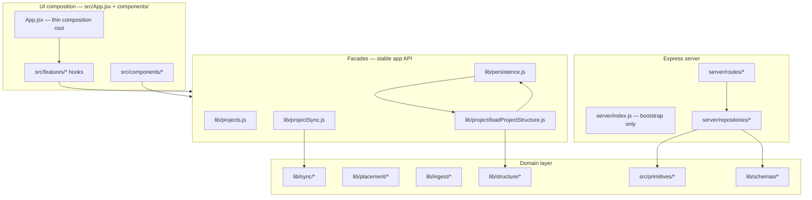
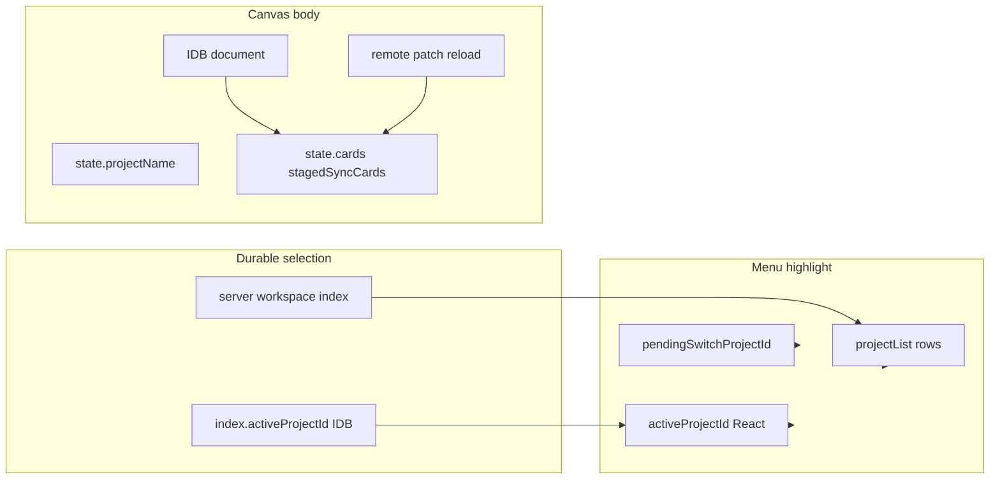

# Canvas Architecture Master Spec

**Version:** 2026.06.24.2
**Version label:** agent-reference-image-bytes
**Status:** Active — this is the single spec authority.

This is the single source of truth for shipped architecture, target data architecture, module boundaries, spec migration, debugging, and testing. Historical runbooks and target-only drafts have been folded into this document.

### Spec versioning

Spec versions use `YYYY.MM.DD.N`, where `N` increments for each accepted spec update on the same date. The label is human-readable only and may change without resetting the numeric version.

Version bumps are required when code changes alter persisted data shape, sync authority, public app architecture, browser debugging workflow, or acceptance gates. Each bump must add a changelog entry that states what shipped and which invariants changed. The spec version is separate from `package.json` and from database migration versions.

### Authority model

| Scope | Authority |
|-------|-----------|
| Rendered canvas today | `canvas_project_document` remains authoritative until the spec-read/write cutover gates pass |
| Spec projection today | `spec_canvas_state` and related `spec_*` tables are a secondary projection maintained by dual-write |
| Target structure | Postgres is authoritative for projects, resources, notes, URL links, clusters, relationships, and canvas layout |
| Content blobs | Filesystem stores bytes only; Postgres rows and IDs remain structural truth |
| Client cache | IndexedDB/localStorage are caches and recovery aids, never durable authority |

---

## 1. System overview



### Layers

| Layer | Path | Responsibility |
|-------|------|----------------|
| UI composition | `src/App.jsx`, `src/features/` | React state wiring; no direct deep `sync/*` imports |
| Facade | `lib/projects.js`, `lib/persistence.js`, `lib/projectSync.js` | Stable exports for app and tests |
| Domain | `lib/sync/`, `lib/placement/`, `lib/ingest/`, `lib/structure/` | Business logic, merge, patch, placement |
| Schemas | `lib/schemas/` | Shared Zod validation at boundaries |
| Server | `server/routes/`, `server/repositories/` | HTTP + Postgres |
| Shared kernel | `src/primitives/`, `lib/sync/projectPatchOps.js` | Used by client and server |

---

## 2. Import boundaries (enforced by convention)

```
UI (App, components, features)
  → lib/projects.js | lib/persistence.js | feature hooks
    → lib/projectSync.js | lib/placement/* | lib/ingest/*
      → lib/sync/*

Server routes
  → server/repositories/*
    → lib/schemas/* | lib/sync/projectPatchOps.js | src/primitives/*
```

**Do not:**
- Import `lib/sync/projectSyncDocument.js` from components
- Add routes to `server/index.js` (use `server/routes/`)
- Write layout to Postgres outside `commitProjectDocument` → `structure/canvasWriteThrough.js`

---

## 3. Feature hooks (`src/features/`)

Extracted from `App.jsx` to reduce the god-component. Each hook owns effects + callbacks for one concern.

| Hook | File | Responsibility |
|------|------|----------------|
| Sync lock | `features/sync/useSyncLockListener.js` | `setSyncLockListener`, banner side-effects |
| SSE streams | `features/sync/useSyncStreams.js` | Project + workspace index SSE |
| Workspace index | `features/sync/useWorkspaceIndexSync.js` | Index refresh, poll, name sync |
| Action sync | `features/sync/useActionSync.js` | `registerActionSyncHandlers`, placement commit |
| Visibility | `features/sync/useVisibilitySync.js` | Tab visible → index refresh + reconcile |
| Page hide | `features/sync/usePageHideFlush.js` | Unload flush coordinator |
| Cache eviction | `features/sync/useProjectCacheEviction.js` | LRU context from index ids |

**Done (Phase 1 continuation):**
- `useProjectSyncLifecycle.js` — boot, background sync, load/switch
- `useFolderLinkScan.js` — folder handle, scan, restore
- `useAgentChatShell.js` — agent panel orchestration

**Done (flow editor):**
- `features/flow/hooks/useFlowDocument.js` — flow load/save, revision CAS, SSE apply
- `features/flow/hooks/useFlowAgentContext.js` — agent context from flow nodes/edges
- `features/flow/hooks/useFlowAgentChatPreviewContext.js` — flow preview in agent chat

**Done (Phase 1b):**
- `useClusterContext.js` — cluster/inspector/graph, hulls, card selection
- `useCanvasDocument.js` — card CRUD, placement, dock, staging, canvas view
- `useProjectWorkspace.js` — create/switch/archive/delete, `resetProjectUi`

**Done (Phase 1c):**
- `CanvasWorkspaceView.jsx` — loaded-state UI composition (Canvas, chrome, overlays, dialogs, RightDock)

**Done (Phase 2 — thin composition root):**
- `useAppShell.js` — composes all feature hooks; builds bundled `viewProps` for `CanvasWorkspaceView`
- `buildWorkspaceViewBundles.js` — groups props into `workspace`, `folder`, `sync`, `canvas`, `cluster`, `agent`, `dialogs`
- `App.jsx` — loading gate + `<CanvasWorkspaceView {...viewProps} />` only (~18 LOC)

---

## 4. Load and commit authority (Phase 4)

### Load path

All project structure loads go through:

```js
import { loadProjectStructure } from '../lib/project/loadProjectStructure.js';
const doc = await loadProjectStructure(projectId, options);
```

Implementation: `loadProjectStructure` → `loadSyncedProjectDocument` → `applyProjectLoadFence` / `reconcileSpecCanvasOnLoad`.

Server-pull, remote-patch, and document-override hydrate paths call `applyProjectLoadFence` before UI consumption or local cache write.

Fenced call sites:
- `useProjectSyncLifecycle` — `applyServerPullResult`, `loadProjectIntoState` overrides
- `projectSyncDocument.pullProjectDocumentIfServerNewer` — after merge, before IDB write
- `projectSyncRemoteApply.applyRemoteProjectPatchNow` — after patch merge, before IDB write

`loadProjectById` in `persistence.js` is a **deprecated alias** — do not add new callers.

Export from facade: `projects.js` → `loadProjectStructure`, `applyProjectLoadFence`.

### Commit path

All layout/placement commits go through:

```js
import { commitProjectDocument } from '../lib/persistence.js';
await commitProjectDocument(projectId, { state, stagedSyncCards, reason, pushRemote });
```

Side effects: local IndexedDB cache / committed-payload cache → optional remote PATCH/PUT via `flushOutgoingProjectDocument`.

Push-only paths (conflict keep-local, boot push) route through `commitProjectDocument` with `pushRemote: true` instead of calling `flushOutgoingProjectDocument` / `pushProjectDocumentIfLocalNewer` directly.

When the remote document write succeeds, `flushOutgoingProjectDocument` dual-writes `spec_canvas_state` unless `skipSpecDualWrite` is explicitly true. `commitProjectDocument` no longer calls `writeThroughSpecCanvasFromPayload` directly; spec state follows successful document CAS instead of moving ahead of the authoritative document write.

`saveProjectById` no longer calls `syncSpecCanvasStateFromPayload` — commit write-through is authoritative.

Push guards:

- Empty local documents are blocked from overwriting a non-empty server document unless `allowEmptyRemoteOverwrite` is explicit or inferred from an intentional artifact-empty commit.
- Dock-only local documents are blocked from overwriting a server document with canvas cards unless the commit reason is the explicit dock placement transfer path.
- `identityRepair.authoritative` and `identityRepair.authoritativeEmpty` remote payloads are authoritative repair documents. They clear the local last-good-card guard and may intentionally replace local non-empty state.
- Folder scan commits may pass `skipInboundReconcile` after a locally richer scan result so a stale server pull does not immediately undo the scan.

### Legacy (deprecated)

| Module | Status | Replacement |
|--------|--------|-------------|
| `loadProjectById` | **Deprecated** | `loadProjectStructure` |
| `saveProjectById` | **Deprecated** (hygiene/create only) | `commitProjectDocument` + `requestActionSync` |
| Direct `loadSyncedProjectDocument` from UI | **Deprecated** | `loadProjectStructure` |
| Direct layout reads from JSON when spec wins | **Deprecated** | `applyProjectLoadFence` / `reconcileSpecCanvasOnLoad` |
| `projectRevision.js` | Active (local storage keys) | Not to be confused with `sync/projectSyncRevision.js` |

---

## 5. Data architecture target

This section is prescriptive for the end-state data model. Where this section says MUST, treat it as a hard rule for new work and for the spec cutover.

### Core principles

1. **Postgres is the source of truth for structure.** Projects, resources, notes, URL links, clusters, their relationships, and canvas layout live in Postgres.
2. **The filesystem is the source of truth for content blobs only.** Resource bodies, note bodies, and chat files are referenced by ID and path metadata from Postgres.
3. **Identity is a UUID, never a file path.** Paths can change; IDs do not.
4. **Resources are shared; notes and URL links are project-specific.** Editing a shared resource updates it everywhere; notes and URL links belong to exactly one project.
5. **Content is never duplicated implicitly.** Resource duplication happens only through an explicit Detach action.
6. **Normal user actions soft-delete.** Resource bytes are purged only when nothing references them and an explicit purge job runs.
7. **Every durable write is tagged with `project_id` where project scope matters.** Stale writes are rejected with optimistic concurrency.

### Identifiers

- Every project, resource, note, URL link, chat, and cluster MUST get a UUID at creation time.
- The ID is generated once, is immutable, and is never reused after delete.
- File paths and sync filenames may be stored as aliases during migration, but MUST NOT become primary identity.

### Filesystem layout

There are two storage locations:

```text
<project_root>/
  notes/
    <note_id>.md
  chats/
    <chat_id>.md
  project.json

<shared_store>/
  resources/
    <resource_id>.<ext>
```

Rules:

- Note and chat blobs live under the project's `root_path` and are project-specific.
- Resource blobs live in the shared store exactly once, regardless of how many projects reference them.
- `notes.file_path` and `chats.file_path` are relative to `projects.root_path`.
- A file with no matching Postgres row is an orphan. Orphan sweeps may remove unmatched shared-resource blobs, but project folders are user-owned and should only be reported, not auto-deleted.

### Target tables

Current migrations use `spec_*` table names while the app migrates. The target model below describes the durable structure those tables converge on.

```sql
CREATE TABLE projects (
  id UUID PRIMARY KEY,
  name TEXT NOT NULL,
  root_path TEXT NOT NULL,
  created_at TIMESTAMPTZ NOT NULL DEFAULT now(),
  updated_at TIMESTAMPTZ NOT NULL DEFAULT now(),
  deleted_at TIMESTAMPTZ,
  version BIGINT NOT NULL DEFAULT 1
);

CREATE TABLE resources (
  id UUID PRIMARY KEY,
  kind TEXT NOT NULL,
  file_path TEXT NOT NULL,
  content_hash TEXT NOT NULL,
  version BIGINT NOT NULL DEFAULT 1,
  created_at TIMESTAMPTZ NOT NULL DEFAULT now(),
  updated_at TIMESTAMPTZ NOT NULL DEFAULT now(),
  deleted_at TIMESTAMPTZ
);

CREATE TABLE project_resources (
  project_id UUID NOT NULL REFERENCES projects(id),
  resource_id UUID NOT NULL REFERENCES resources(id),
  created_at TIMESTAMPTZ NOT NULL DEFAULT now(),
  PRIMARY KEY (project_id, resource_id)
);

CREATE TABLE notes (
  id UUID PRIMARY KEY,
  project_id UUID NOT NULL REFERENCES projects(id),
  title TEXT,
  file_path TEXT NOT NULL,
  version BIGINT NOT NULL DEFAULT 1,
  created_at TIMESTAMPTZ NOT NULL DEFAULT now(),
  updated_at TIMESTAMPTZ NOT NULL DEFAULT now(),
  deleted_at TIMESTAMPTZ
);

CREATE TABLE note_links (
  note_id UUID NOT NULL REFERENCES notes(id),
  resource_id UUID NOT NULL REFERENCES resources(id),
  created_at TIMESTAMPTZ NOT NULL DEFAULT now(),
  PRIMARY KEY (note_id, resource_id)
);

CREATE TABLE url_links (
  id UUID PRIMARY KEY,
  project_id UUID NOT NULL REFERENCES projects(id),
  url TEXT NOT NULL,
  title TEXT,
  description TEXT,
  created_at TIMESTAMPTZ NOT NULL DEFAULT now(),
  updated_at TIMESTAMPTZ NOT NULL DEFAULT now(),
  deleted_at TIMESTAMPTZ
);

CREATE TABLE clusters (
  id UUID PRIMARY KEY,
  project_id UUID NOT NULL REFERENCES projects(id),
  name TEXT NOT NULL,
  created_at TIMESTAMPTZ NOT NULL DEFAULT now(),
  deleted_at TIMESTAMPTZ
);

CREATE TABLE cluster_members (
  cluster_id UUID NOT NULL REFERENCES clusters(id),
  resource_id UUID NOT NULL REFERENCES resources(id),
  PRIMARY KEY (cluster_id, resource_id)
);

CREATE TABLE canvas_state (
  project_id UUID PRIMARY KEY REFERENCES projects(id),
  layout JSONB NOT NULL,
  viewport JSONB NOT NULL,
  version BIGINT NOT NULL DEFAULT 1,
  updated_at TIMESTAMPTZ NOT NULL DEFAULT now()
);

CREATE TABLE chats (
  id UUID PRIMARY KEY,
  project_id UUID NOT NULL REFERENCES projects(id),
  agent_id TEXT NOT NULL,
  file_path TEXT NOT NULL,
  ordering INTEGER NOT NULL,
  created_at TIMESTAMPTZ NOT NULL DEFAULT now(),
  deleted_at TIMESTAMPTZ
);
```

Foreign keys MUST stay enforced. A note may only link to a resource referenced by the same project through `project_resources`.

### Canvas state

Placement is per-project even when content is shared. Placeable node kinds are `resource`, `note`, and `url`; each placed node is identified by `kind` plus `id`.

```json
{
  "placed": [
    { "kind": "resource", "id": "<uuid>", "x": 120, "y": 80, "w": 240, "h": 160, "cluster_id": null },
    { "kind": "note", "id": "<uuid>", "x": 400, "y": 80, "w": 200, "h": 140 },
    { "kind": "url", "id": "<uuid>", "x": 640, "y": 80, "w": 200, "h": 80 }
  ]
}
```

```json
{ "x": 0.0, "y": 0.0, "zoom": 1.0 }
```

- `cluster_id` applies to resource nodes only.
- Connectors from notes to resources are rendered from `note_links`, not stored in layout.
- Selection, hover, and in-flight drag position are React-only view state.
- Persistent canvas changes are debounced and flushed on blur / unload; drag frames are not individually persisted.
- Drag and resize commits use final pointer-up geometry from `canvasPointerGeometry.js` and dispatch one `layoutCommit` payload with card updates.

### Shared resources and Detach

- Adding a resource to a project inserts `project_resources(project_id, resource_id)` and does not copy bytes.
- Editing a resource writes the new blob, recomputes `content_hash`, updates the resource row with a version check, and becomes visible to other referencing projects on next load.
- Detach is the only implicit-copy escape hatch: mint a new resource ID, copy bytes, insert the new resource row, and in one transaction repoint the current project's project-resource row, canvas placements, cluster membership, and note links.
- The UI should expose the reference count for shared resources.

### Write ordering and deletes

- For rows with file bodies, write the blob first, then insert/update the Postgres row.
- Concurrent resource or note edits use optimistic concurrency and retry once after re-fetch.
- Multi-table operations run in one transaction.
- Removing a resource from a project removes that project's reference, note links, cluster memberships, and canvas placement; shared bytes survive while any project references them.
- Deleting notes, URL links, and projects is soft-delete. Project deletion removes project-specific references without deleting resources still used elsewhere.

### Target API surface

Minimum target endpoints:

```text
POST   /projects
GET    /projects
GET    /projects/:id
DELETE /projects/:id

POST   /resources
GET    /resources/:id
PUT    /resources/:id
DELETE /resources/:id

POST   /projects/:id/resources
DELETE /projects/:id/resources/:rid
POST   /projects/:id/resources/:rid/detach

POST   /projects/:id/notes
GET    /projects/:id/notes
PUT    /notes/:id
DELETE /notes/:id
POST   /notes/:id/links
DELETE /notes/:id/links/:rid

POST   /projects/:id/urls
GET    /projects/:id/urls
PUT    /urls/:id
DELETE /urls/:id

GET    /projects/:id/canvas
PUT    /projects/:id/canvas

POST   /projects/:id/clusters
PUT    /clusters/:id/members

POST   /projects/:id/chats
GET    /projects/:id/chats
```

### Target acceptance criteria

1. Refresh restores the exact canvas layout and viewport for the open project.
2. Switching projects and switching back shows each project's own canvas unchanged.
3. A slow save for Project A that completes after switching to B does not alter B.
4. Editing a shared resource in one project updates another project that references it on next load, without duplicating files.
5. Detaching a resource creates an independent copy and repoints the detaching project's placement, cluster membership, and note links.
6. Deleting a project does not remove resources still referenced by another project.
7. Resource bytes are removed only after no projects reference them and only via purge.
8. Notes and URL links created in one project never appear in another project.
9. Note-resource links persist across refresh and project switch, and connectors render from `note_links`.
10. A note cannot link to a resource its project does not reference.
11. Deleting a note removes its links but leaves linked resources intact.
12. A failed create never leaves a Postgres row pointing at a missing file.
13. Two tabs editing the same resource or note do not silently overwrite each other.
14. The UI shows how many projects reference a shared resource.

### Anti-patterns

- Do not use file paths or filenames as primary identity.
- Do not store canvas state only in localStorage or React state.
- Do not share notes or URL links between projects.
- Do not duplicate resource bytes except through Detach.
- Do not store a resource's position on the resource.
- Do not store note-resource connectors in layout JSON.
- Do not let a note link to a resource its project does not reference.
- Do not delete resource bytes while any project still references them.
- Do not write a DB row before its file is safely on disk.
- Do not hard-delete on normal delete actions.
- Do not save canvas state on every drag frame.
- Do not apply a save response for a project that is no longer active.
- Do not poll for live cross-project resource edits; use a notification channel if live propagation is added.

---

## 6. Spec data plane migration

### Phase 2 (shipped): `artifactPlacements` in project JSON

- **Field:** `artifactPlacements` — map of canonical sync key to `{ surface, record }`
- **Version:** `artifactPlacementsVersion: 1`
- **Load:** `normalizeLoadedProject` → `reconcileArtifactPlacements`; the map is authoritative when present and legacy arrays migrate on first load
- **Save:** `buildProjectSavePayload` → `attachArtifactPlacementsToPayload`
- **Compatibility:** `cards` and `stagedSyncCards` remain in the payload until cutover

### Linked-folder subfolder artifacts

Linked folder scans are recursive. Root-level files keep their historical canonical sync keys, while nested files include their normalized relative path so duplicate basenames do not collide:

| Disk path | Canonical sync key |
|-----------|--------------------|
| `notes__site-v1.md` | `notes__site` |
| `refs/notes__site-v1.md` | `refs/notes__site` |
| `refs/archive/notes__site-v1.md` | `refs/archive/notes__site` |

Rules:

- `scanFolderFiles` walks directory handles recursively with stale-scan cancellation, ignored folders (`node_modules`, `.git`, hidden/system folders), max-depth, and max-file limits.
- Folder-backed versions may carry both `filename` (basename) and `relativePath` (normalized path from the linked root). Consumers must resolve file reads through `relativePath` when present.
- Preview cache keys, staging, `folderPresentKeys`, artifact ingest URIs, outbox entries, agent context reads, external open, and stripped-content hydration use the path-aware canonical key.
- **Canvas edits** to `user_note` and `markdown` cards save to the linked folder via `saveUserNote` / `saveMarkdownArtifact` when `noteRequiresProjectOnlySave` is false (folder linked and card key present in `folderPresentKeys`). Writes use `folderRelativePathFromVersion` (`overwriteTextFileAtPath` in `folderWrite.js`) so nested subfolder files update in place, not only at the linked-folder root.
- `noteRequiresProjectOnlySave` (`filename.js`) returns true only when there is no `folderHandle`, or when the card key is absent from a non-empty `folderPresentKeys` scan set. An empty scan set is treated as presence-unknown (not “all missing”). Nested `relativePath` no longer forces project-only saves.
- App-created notes, bookmarks, and agent chat transcripts still **create** at the linked-folder root. Nested files are read and staged from subfolders; in-place body edits hit the on-disk path via `relativePath`.
- Dock hover UI may show nested `relativePath` for disambiguation; root files keep the existing label behavior.
- Bookmark writes prefer `.url` shortcuts, then fall back to `.bookmark.md` when the browser or filesystem rejects shortcut filenames.
- Bookmark sidecars use Markdown:

```md
# Display title

URL: https://example.com/page
```

- Folder scans parse `.bookmark.md` sidecars as bookmark artifacts, normalize the URL, hydrate preview metadata when available, and use `bookmark.md` as the parsed extension.
- Bookmark keys and filenames include a short card-id-derived suffix for app-created bookmarks, so multiple links from the same domain can coexist.
- Folder scan matching uses the path-aware folder key first, then normalized bookmark URL as a fallback to avoid duplicate bookmark staging after filename fallback or repair.
- Folder scan ownership is explicit: a scan only uses live canvas cards as baseline when the scan project is the settled active project and no switch is in progress.
- `folderPresentKeys` is scan-output authority only. It must contain canonical keys found on disk during the latest successful linked-folder scan; project load must not union canvas or dock rows into this set because that masks files removed from the project folder.
- Canvas cards whose folder-backed key is absent from `folderPresentKeys` remain on the canvas, are highlighted as missing, and show a missing-file alert. The user chooses whether to restore the file and sync again or remove the card from the canvas.

### Workspace primitive scope and cleanup (shipped)

The workspace side panel has two projections:

- **Project** view is the default. It is derived from the active project's canvas cards and dock/staged cards, plus database primitives reachable from that project scope.
- **All Projects** view groups primitives and events by project metadata from `canvas_workspace_index.payload.projects`; aggregate queries must not surface clusters or primitives outside active or archived projects.

Selection and navigation rules:

- `workspacePlacementIndex.js` maps primitive refs to canvas/dock placement so selecting a canvas artifact highlights the matching workspace row and selecting a workspace row can highlight the canvas card.
- Double-clicking artifacts or clusters in the workspace tree zooms the canvas with right-dock-aware padding; the inspector is not the owner of zoom behavior.
- Agent chat cards use the same canvas card shell as artifacts but carry a thread outline and bot icon in agent green: `#50c878` in light mode (2px outline) and neon `#39ff14` in dark mode (1px outline). Theme tokens live in `index.css` (`--color-agent-chat-outline`, `--color-agent-chat`).

Cleanup rules:

- Project deletion runs `deleteProjectPrimitiveScope` in the project delete transaction.
- Missing dock-only folder artifacts are pruned during successful folder scans and call `DELETE /projects/:projectId/artifacts/:artifactId` for targeted project-scope cleanup.
- Deleting a missing/red canvas card first persists the project document cleanup via structural sync, then uses the same targeted artifact cleanup helper.
- `deleteProjectArtifactRef` removes project cluster membership and deletes the artifact row only when no project scope still references it.
- `scripts/purge-orphan-workspace-items.mjs` is a one-off dev/admin purge for primitives not mapped to active or archived projects; dry run is default.

### Bookmark previews and open behavior (shipped)

- `GET /bookmarks/preview` fetches metadata and uses server-side screenshot fallback for Amazon links whose Open Graph image is a generic Amazon logo.
- If screenshot fallback fails for a generic Amazon image, the preview image is `null`; the client must not resurrect a stale cached Amazon logo from `objectUrl` or `previewCacheKey`.
- Bookmark editors expose refresh-preview actions that re-fetch metadata and clear stale cached preview sidecars when a new preview image is saved.
- `GET /bookmarks/embed` can serve same-origin proxied HTML for editor preview surfaces that need embeddable page content.
- Canvas bookmark/link open behavior is external: double-clicking a bookmark card opens the pinned `externalUrl` in a new browser tab/window and does not open `CardModal` full-screen preview.

### Flow artifacts (shipped)

Flow cards are a separate artifact type (`flow`) with their own revisioned Postgres document, distinct from the project canvas layout JSON.

Tables (`server/migrations/0014_flow_artifacts.sql`):

- `flow_document` — title, description, viewport, revision CAS, optional `snapshot_path`
- `flow_node` — `artifact` nodes (linked primitive) or `local` nodes (inline title/description)
- `flow_edge` — directed connections with typed presentation metadata

API (`server/routes/flows.js`):

| Method | Path | Purpose |
|--------|------|---------|
| POST | `/projects/:projectId/flows` | Create flow artifact + document |
| GET | `/flows/:flowId` | Fetch full flow snapshot |
| PUT | `/flows/:flowId` | Replace snapshot with `expectedRevision` CAS (409 on conflict) |
| DELETE | `/flows/:flowId` | Delete flow |
| GET | `/flows/:flowId/stream` | SSE `flow_created` / `flow_updated` / `flow_deleted` |

Client (`src/features/flow/`):

- `FlowEditor.jsx` — `@xyflow/react` editor; artifact nodes embed live `CardPreview`
- `FlowPreview.jsx` — compact canvas-card preview from `flowPreview` snapshot on pinned version
- `useFlowDocument.js` — load, dirty tracking, debounced autosave (`flowAutosave.js`), manual `flushSave`, SSE apply with `clientId` skip; `save()` clears pending timers and skips when clean unless forced
- `flowSnapshot.js` — optional linked-folder snapshot file at `flows/<flowId>.json`
- Flow cards on the main canvas use the `flow` card type; opening the modal launches the flow editor
- `closeOpenCard` in `useCanvasDocument.js` — central flush-before-close for X, Escape, and project-switch reset; blocks close when flush fails unless user discards
- `formatFlowSaveError` — maps validation vs network errors in the flow editor toolbar

Rules:

- Flow layout authority is `flow_document` + nodes/edges tables, not `canvas_project_document` cards layout
- Artifact nodes reference existing primitive `artifact_id`; local nodes are flow-local only
- On `PUT /flows/:flowId`, `replaceFlow` auto-registers referenced artifact IDs into the project workspace `cluster_member` when the artifact row exists (canvas cards may carry `artifactRef` before cluster membership)
- Flow editor artifact palette lists only canvas cards with a synced `artifactRef` (`artifactRefIdForClusterCard`)
- Save failures surface in the flow toolbar; close does not silently discard dirty edits when flush returns `ok: false`
- Edge connection types and custom labels live in edge `presentation` JSON (`flowConnectionTypes.js`)
- Agent context can include selected flow nodes via `useFlowAgentContext`
- Flow agent mode UI (`flowAgentUiPersistence.js`) persists per-flow-card last thread and panel section layout; restored when agent mode is re-enabled on that flow card

### Agent templates (shipped)

Database-backed agent definitions replace ad-hoc connector config for reusable multi-file agents.

Tables (`server/migrations/0013_agent_templates.sql`):

- `agent_template` — label, provider, model, enabled, compiled JSON, revision CAS
- `agent_template_file` — `instructions`, `model`, `skill`, or `tool` file parts with parsed metadata

API (`server/routes/agentTemplates.js`):

| Method | Path | Purpose |
|--------|------|---------|
| GET | `/agent/templates` | List templates |
| GET | `/agent/templates/:templateId` | Fetch one template + files |
| POST | `/agent/templates` | Create template |
| PUT | `/agent/templates/:templateId` | Update with `expectedRevision` CAS |
| DELETE | `/agent/templates/:templateId` | Delete template |
| POST | `/agent/templates/import-master` | Import `Agent - *` folders from `Canvas Master Files/` |

Shared parsing lives in `src/lib/agentTemplates.js` (frontmatter, file-kind detection, tool allowlist). Template file kinds map to `instructions/`, `models/`, `skills/`, and `tools/` paths.

### Multi-provider agent chat (shipped)

`server/services/agentChatProvider.js` routes chat completion by provider:

- **openai** — existing `openaiChat.js`; requires stored API credential
- **ollama** — `ollamaChat.js` against `http://localhost:11434/api/chat`; no API key

Connectors (`server/lib/agentConnectors.js`, mirrored client-side):

| Connector id | Label | Provider | Model |
|--------------|-------|----------|-------|
| `openai` | ChatGPT | openai | gpt-4o-mini |
| `ollama-gemma-12b` | Gemma 12B Local | ollama | gemma4:12b |
| `ollama-gemma-26b` | Gemma 26B Local | ollama | gemma4:26b |

Ollama availability is probed at runtime via `GET /agent/connectors` (`needsPull` when reachable but model missing). Selecting a Gemma connector in Agent mode triggers `POST /agent/ollama/pull` (streamed NDJSON progress) to download the model on demand. `start canvas` mounts the persistent Docker volume `ollama` at `/root/.ollama` but does not pre-pull weights.

Each connector exposes `capabilities: { canReadImages, canReadText, canUseTools }` on `/agent/connectors`. Gemma and ChatGPT connectors set `canReadImages: true`. Image context cards are converted to Ollama `messages[].images` (base64 without `data:` prefix) in `ollamaChat.js`. Canvas context messages are folded into the latest user turn, including merged `images` arrays. If images are attached but the selected connector lacks `canReadImages`, the Agent panel warns and blocks send (no silent text-only drop).

Generated image artifacts load into chat context via inline `pinned.dataUrl` or artifact `payload_text` without requiring a linked folder.

### Code file previews (shipped)

Source-code artifacts (`code` card type and extensions resolved by `isCodePreviewType`) render syntax-highlighted previews:

- `src/lib/codeHighlight.js` — `highlight.js` wrapper; resolves language from extension/filename
- `src/components/CodePreviewFrame.jsx` — compact and full-size highlighted `<pre>` used by `CardPreview` and `ModalContent`

Supported extensions include `.js`, `.jsx`, `.ts`, `.tsx`, `.mjs`, `.cjs` (mapped to JavaScript/TypeScript grammars). Unknown languages fall back to escaped plain text.

Agent context (`agentContextContent.js`) includes `code` cards as text, subject to the same per-file and total char budgets as markdown.

**Load authority when a folder is linked:** for `markdown`, `user_note`, `code`, `html`, and legacy `note` types, `loadContextDocumentForCard` reads the linked folder file **before** `artifact.payload_text`. Artifact API text is a fallback when the folder is unlinked, unreadable, or empty. `agent_chat` keeps API-first order (artifact → transcript loader → folder).

**Pre-linked freshness:** `hydrateContextAddMessage` (`agentContextSession.js`) rebuilds `apiContent` from current cards on **every** agent send (no in-memory `apiContent` short-circuit). Historical `context_add` messages in the thread therefore reflect the latest on-disk bodies after canvas saves, without re-adding cards. When `content_hash` changes, the existing registry still appends `context_remove` + `context_add` deltas via `diffContextRegistry`.

**Canvas inline edit:** active `user_note` and `markdown` cards support preview-first inline edit (`CardPreview` → `UserNoteInlineEditor` / `EditableMarkdownMessage`). Save routes through `handleInlineSaveUserNote` / `handleInlineSaveMarkdown` in `useCanvasDocument.js`. Successful folder writes show a **Saved to folder** toast (`strings.userNote.savedToFolder`).

### Spreadsheet previews (shipped)

Excel/CSV artifacts support two persisted viewer modes selected via `SpreadsheetViewerSelect` on canvas cards and in `CardModal`:

- **Simple table** — existing SheetJS HTML table (`SpreadsheetPreviewFrame.jsx`)
- **Excel viewer** — `@extend-ai/react-xlsx` WASM viewer (`ExtendSpreadsheetPreviewFrame.jsx`), lazy-loaded via `xlsxWasm.js`

Shared client modules:

- `useSpreadsheetBuffer.js` — binary load from linked folder / artifact ref
- `useSpreadsheetViewerPreference.js` — persisted viewer choice with in-memory pub/sub so card and modal stay in sync
- `SpreadsheetArtifactView.jsx` — orchestrates viewer switch + buffer state
- `spreadsheetViewerTheme.js` — maps app palette (`light` / `dark` / `green` / `blue`) to viewer chrome; `useTheme.js` pub/sub keeps Extend viewer in sync when the palette changes

Canvas card toolbar clicks and artifact scroll regions are excluded from card drag via `cardDragIgnoresTarget` (`data-artifact-scroll`, `data-card-artifact-controls`).

### Canvas viewport navigation (shipped)

`Canvas.jsx` owns pan/zoom for the main workspace:

- **Background left-drag** pans the viewport (`viewCommit` on pointer-up).
- **Mouse wheel** pans; **Ctrl/Meta + wheel** zooms toward the cursor (`clampCanvasZoom` 0.1–3).
- **Ctrl/Meta + left-drag** over artifacts, cluster grips, resize handles, or link handles pans instead of moving cards (`canvasPanModifier.js`, `beginPanGesture`). Pan uses synchronous refs plus window `pointermove`/`pointerup` so drag begins immediately when Ctrl and the primary button are held together. Pressing Ctrl while the primary button is already down cancels an in-flight card/cluster drag and switches to pan without releasing the mouse.
- Artifact scroll areas (`[data-artifact-scroll]`) keep wheel scrolling local; canvas wheel handling does not intercept those targets.

Agent Mode context selection on canvas cards uses theme tokens `--color-agent-selection-ring` / `--color-agent-selection-glow` (accent orange in light mode, white in dark/green/blue).

### Per-card media minimal preview (shipped)

Image and video cards on the **main canvas** support an optional per-card `minimalPreview` flag (persisted on the card document like `audioSkinColor`):

- **Full mode (default):** standard card chrome — type/filename header, shadow, padding, toolbar.
- **Minimal mode:** preview-only shell — media fills the card; no header, surface shadow, or decorative rings. A toolbar toggle appears when the card is **selected** in full mode; a floating corner toggle appears when a minimal card is selected so the user can restore full chrome.
- **Scope:** `image` and `video` card types only; flow editor and other card types are unchanged.

Client: `MediaMinimalToggle.jsx`, `CanvasCard.jsx` (`minimalChrome` branch), `CardPreview.jsx` (full-bleed image layout). Serialization: `projectSlim.js`, `syncStaging.js`, `specDataPlane.js`.

### Phase 3 (partial): Postgres spec tables and dual-write

Implemented by `server/migrations/0010_spec_data_plane.sql`:

- `spec_resource`, `spec_project_resource`
- `spec_note`, `spec_url_link`, `spec_note_link`
- `spec_canvas_state` (layout, viewport, version)
- `spec_chat`

Spec routes:

| Method | Path | Purpose |
|--------|------|---------|
| GET | `/canvas/projects/:id/spec-canvas` | Fetch spec layout/viewport |
| PUT | `/canvas/projects/:id/spec-canvas` | Save with `expectedVersion` CAS |
| GET | `/spec/resources/:id` | Resource + reference count |
| POST | `/canvas/projects/:id/spec-resources/:rid/link` | Add project reference |
| POST | `/canvas/projects/:id/spec-resources/:rid/detach` | Detach / repoint reference |
| GET/POST/DELETE | `/spec/notes/:noteId/links` | Note-resource links |

Workspace index realtime: `GET /canvas/index/stream` broadcasts `index_updated` after successful `PUT /canvas/index`, including `clientId` so the origin tab can skip redundant refresh.

Client dual-write:

- **Save:** successful project document PATCH/PUT paths call `syncSpecCanvasStateFromPayload`; `structure/canvasWriteThrough.js` remains the reason-filtered helper for explicit write-through callers.
- **Load:** `reconcileSpecCanvasOnLoad` applies `spec_canvas_state` when the version matches document revision, when spec-only data exists, or when spec version is at least the document revision. Otherwise project JSON remains authoritative and drift is logged.

Repair tooling:

- `scripts/repair-canvas-state-drift.mjs` compares `canvas_project_document` payloads to `spec_canvas_state` layout/viewport/placement maps.
- Dry run is default. `--apply` rewrites document payload layout from spec state; `--delete-orphans` may remove orphan spec rows; `--project=<id>` scopes the repair.

Current gaps before the target data architecture is complete:

- Shared resource store on disk under `<shared_store>/resources/`
- `projects.root_path` with `notes/` and `chats/` migration
- UUID-only identity everywhere; filename/sync keys still exist in JSON paths
- Live cross-project resource propagation
- UI reference count from `spec_project_resource`
- Connectors rendered only from `spec_note_link`
- Hard cutover to DB-only layout without full `canvas_project_document`

### Phase 4+ cutover design

Current invariant: `canvas_project_document` remains the rendered-canvas authority. `spec_canvas_state` is a secondary projection until every gate below passes in tests and browser smoke.

1. **Identity and soft-delete foundation**
   - Add `deleted_at`, `deleted_by`, and `delete_reason` to removable project, resource-link, note-link, and canvas-state rows.
   - Keep hard deletes only for cache/blob cleanup tables and test reset scripts.
   - Normalize client-generated IDs at creation boundaries.
   - Store legacy filename/sync keys as aliases, not primary identity.
   - Gate: deleting a project removes it from `canvas_workspace_index` and marks server rows deleted without allowing stale local caches to recreate the row.

2. **Shared resource store**
   - Use content hash plus UUID: hash dedupes bytes; UUID remains app-facing identity.
   - Store bytes under `<shared_store>/resources/<sha256-prefix>/<sha256>` for large blobs.
   - Project membership lives in `spec_project_resource(project_id, resource_id, role, created_at, deleted_at)`.
   - Gate: importing the same file into two projects creates one resource row and two project-resource rows; deleting one project leaves the resource available to the other.

3. **DB-only canvas state shadow mode**
   - Extend `spec_canvas_state.layout` to render card placement, staging placement, and artifact placement map entries.
   - On every `commitProjectDocument`, dual-write project JSON and spec layout with CAS; retry once and enqueue outbox on remaining conflict.
   - Add a diagnostic loader that builds a project payload from `spec_canvas_state` and compares it to `canvas_project_document`.
   - Gate: JSON -> spec -> JSON round-trip tests cover canvas cards, staging cards, viewport, and artifact placements.

4. **Read cutover**
   - Feature flag: `canvas-spec-layout-read=1`.
   - `loadProjectStructure` reads `spec_canvas_state` first behind the flag, then falls back to project JSON if spec is missing or stale.
   - SSE remains notification-only; clients still validate `version` / `revision` before applying data.
   - Rollback: disable the flag and keep project JSON writes active.
   - Gate: browser smoke passes project switch, placement, refresh, and rapid switch with spec-read enabled.

5. **Write cutover**
   - `commitProjectDocument` writes `spec_canvas_state` as the primary command and writes a slim `canvas_project_document` snapshot only for rollback/export.
   - CAS authority moves from document `revision` to spec `version` for layout changes. Project metadata keeps its own workspace index revision.
   - Gate: stale layout writes conflict on `spec_canvas_state.version` and cannot overwrite newer card positions.

6. **Cleanup and compatibility removal**
   - Stop writing full layout arrays to `canvas_project_document`.
   - Remove legacy localStorage project-body recovery for spec-read clients after a migration window.
   - Keep export/import support by generating the old JSON shape from spec rows.
   - Gate: reset, delete-all-projects, and browser reconnect cannot resurrect projects from old local caches.

### Required gates before cutover

- `npm run test:sync` covers project sync, project CRUD, route/SSE, Postgres CAS, IndexedDB cache, and spec dual-write tests.
- Add browser smoke with `canvas-spec-layout-read=1` before enabling spec-read by default.
- Add a Postgres-backed test that creates one shared resource, links it to two projects, soft-deletes one project, and verifies the resource remains linked to the other.
- Add migration idempotence tests: running the backfill twice produces the same row counts and no duplicate aliases.
- Add rollback test: after spec-read is disabled, the project still loads from `canvas_project_document`.

### Applying migrations

```bash
cd canvas
npm run db:migrate
```

### Interim document revision sync

Until layout is fully authoritative in `spec_canvas_state`, the client keeps `canvas_project_document.revision` in sync via:

- `reconcileActiveProject` on poll, visibility resume, and project switch; it adopts revision when payloads match and pushes or pulls otherwise
- `seedClientRevisionFromMeta` after cache-first project load
- automatic revision healing instead of a blocking stale-tab state when possible

### Migration verification

1. Verify dock-only chats do not trigger repeat sync modals and do not create canvas+dock duplicates.
2. Save a project and inspect JSON for `artifactPlacements`.
3. With API and Postgres up, `GET /canvas/projects/{id}/spec-canvas` returns layout mirroring cards/staging.

---

## 7. Server routes (Phase 2)

| Router file | Prefix / paths |
|-------------|----------------|
| `routes/health.js` | `GET /health` |
| `routes/canvasProjects.js` | `/canvas/index`, `/canvas/projects/*` |
| `routes/canvasPreviews.js` | `/canvas/previews/*` |
| `routes/canvasAgentChat.js` | `/canvas/agent-chat/*` |
| `routes/spec.js` | `/canvas/projects/:id/spec-*`, `/spec/*` |
| `routes/clusters.js` | `/clusters/*`, `DELETE /projects/:projectId/artifacts/:artifactId` |
| `routes/artifacts.js` | `/artifacts/*`, `/bookmarks/preview`, `/bookmarks/embed` |
| `routes/primitives.js` | `/primitives/*`, `/relationships/*`, `/notes/*`, `/assertions/*`, `/tasks/*`, `/workspace/primitives`, `/workspace/events` |
| `routes/agent.js` | `/agent/chat`, `/agent/ollama/pull`, provider-aware completion |
| `routes/agentTemplates.js` | `/agent/templates/*` |
| `routes/flows.js` | `/projects/:projectId/flows`, `/flows/:flowId`, `/flows/:flowId/stream` |

`server/index.js` — middleware, DB init, route registration, listen only.

---

## 8. Schema validation (Phase 3)

Shared Zod schemas in `lib/schemas/`:

| Schema | Used at |
|--------|---------|
| `projectPatchOpsSchema` | Client before push; server PATCH handler |
| `projectDocumentSchema` | Optional strict validation on PUT |
| `workspaceIndexSchema` | Index PUT validation |

Run validation via `lib/schemas/validate.js` helpers.

---

## 9. Debugging

See **[DEBUGGING_GUIDE.md](DEBUGGING_GUIDE.md)** for the full system map, per-flow trace stages, and symptom tables.

### Local dev stack

One-command local development is owned by `scripts/dev-stack.mjs` (config: `dev-stack.config.json`, env overrides: `.env.example`). Full runbook: **[DEV_STACK.md](DEV_STACK.md)**.

| Agent prompt | npm script | Behavior |
|--------------|------------|----------|
| **start canvas** | `npm run dev:stack` | Launch Docker Desktop when needed (Windows/macOS), `docker compose up` Postgres, migrate, Ollama (`canvas-ollama` + `ollama` volume), API on `:3001`, Vite on `:5173` |
| **restart canvas** | `npm run dev:stack:restart` | `dev-stack-stop` then `dev-stack --no-docker-boot` — API/Vite only; assumes Docker already running |
| **stop canvas** | `npm run dev:stack:stop` | Stop API/Vite background processes; leave Postgres/Ollama containers up |

**Services:**

| Service | Port | Container / process |
|---------|------|---------------------|
| Postgres | 5432 | `canvas-postgres` (`../docker-compose.yml`) |
| API | 3001 | `npm run server` → `GET /health` |
| Vite | 5173 | `npm run dev` (proxies `/api` → API) |
| Ollama | 11434 | `canvas-ollama` (volume `ollama` → `/root/.ollama`; legacy container `ollama` supported) |

**Ollama models:** not pulled at boot — select **Gemma 12B/26B Local** in Agent mode to download on demand.

**Browser debugging prerequisite:** after **start canvas**, verify at `http://localhost:5173` with API health at `http://localhost:3001/health`. See [`AGENTS.md`](../AGENTS.md) Cursor browser checklist (I1 menu/header alignment).

### Sync trace

Enable verbose sync logging in browser console:

```js
localStorage.setItem('canvas-sync-trace', '1');
// reload (legacy alias: canvas:sync-trace)
```

Implementation: `lib/sync/syncTrace.js` — logs patch summaries, reconcile decisions, flow stages (`project:create`, `project:switch`, etc.). See [DEBUGGING_GUIDE.md](DEBUGGING_GUIDE.md).

Dev snapshots:

- `window.__canvasProjectionSnapshot()` — selection phase, hydration, mutation gate, revision.
- `window.__canvasDocumentSnapshot(projectId?)` — committed card and placement keys.
- `window.__canvasFolderSnapshot()` — folder handle ownership, stored permission state, picker/probe state, and present-key count.

### Placement audit

```js
localStorage.setItem('canvas-placement-audit', '1');
// legacy alias: canvas:placement-audit
```

Steps logged by `lib/placement/placementAudit.js` during load, commit, transfer.

### Server patch trace

PATCH requests accept `traceId` in body; server logs via `syncTraceLog(traceId, ...)`.

### Menu / canvas / database drift

Selection and canvas are **multiple projections**, not one React field. When the menu checkmark, header title, and canvas cards disagree, trace which layers updated.



| Layer | Location | Drives |
|-------|----------|--------|
| `pendingSwitchProjectId` | `useAppShell` | Menu highlight during switch |
| `activeProjectId` | `useAppShell` | Committed selection after successful load |
| `activeProjectIdRef` | `useAppShell` | `shouldApplyProjectLoad`, switch guards |
| Index `activeProjectId` | `lib/projects.js` / IDB | Boot + `persistActiveProjectId` |
| Server index | Postgres + SSE `index_updated` | Cross-browser project list |
| `projectList` | `useAppShell` | `ProjectSwitcher` rows |
| `state` / `loadProjectIntoState` | `useProjectSyncLifecycle` | Canvas cards |
| Header display | `resolveHeaderProjectName` in `CanvasWorkspaceView` | Header `textbox` (menu row when not dirty) |

**Workspace projection (Phase 2):** [`useWorkspaceProjection.js`](../src/features/workspace/useWorkspaceProjection.js) is the single coordinator for selection lifecycle. Consumers read `workspaceProjection` from `buildWorkspaceViewBundles` (not scattered `??` in the view).

| Field | Meaning |
|-------|---------|
| `effectiveProjectId` | `pending ?? committed` — menu, header, canvas target during switch |
| `committedProjectId` | React `activeProjectId` after successful load |
| `phase` | `idle` \| `selecting` \| `ready` \| `noProjects` |
| `canMutateCanvas` | I6 — blocks placement while switching |

**Transitions:** `selectProject(targetId)` (outgoing commit → load → persist), `commitBoot` / `commitBootWithRecovery` (cold start via `resolveInitialProjectId.js`). Boot rehydrate repairs **same** id only; no second `findBestProjectIdWithLocalCanvas` pass.

**Empty UX:** `noProjects` → create prompt; projects exist but `committedProjectId == null` → select-project prompt (`SelectProjectPrompt.jsx`).

**Agent trace checklist** (see also [`AGENTS.md`](../AGENTS.md)):

1. **Cursor browser:** `http://localhost:5173` — `browser_navigate` → `lock` → `snapshot` → switch project → assert menu checkmark row === header `textbox` name (I1).
2. Enable `canvas-sync-trace` and reproduce.
3. Fill a step table: file/function → input → output → `projectId` → `revision` / `switchSeq`.
4. Note whether `loadProjectIntoState` returned `null` (`shouldApplyProjectLoad` / superseded switch).
5. On switch failure, confirm `restoreWorkspaceProject(previousId)` ran only when `switchStillCurrent`.
6. Dev: `window.__canvasProjectionSnapshot()` for projection fields.
7. Run `npm run test:sync` after fixes.

**Pure invariant helpers:** `src/lib/syncProjectionInvariants.js` — includes `resolveHeaderProjectName` (I1 menu/header alignment); tested in `syncProjectionInvariants.test.js`.

### Common issues

| Symptom | Check |
|---------|-------|
| Menu shows FROG, canvas TREE STORM | Selection layers table above; failed switch without reload? `pending` cleared in `finally`? |
| Stale canvas after edit | `getClientRevision(projectId)` vs server meta; SSE connected? |
| Placements lost on switch | `artifactPlacements` in committed payload; `placement-persistence-qa.md` |
| Dock→canvas reverts on refresh | `placement-persistence-qa.md` § Placement commit debug; `canvas-sync-trace` + `__canvasProjectionSnapshot` + `__canvasDocumentSnapshot`; look for `placement:commit-deferred` / missing `commit:done` |
| Index out of sync | `GET /canvas/index/stream`; poll interval |
| Spec vs document drift | `GET /canvas/projects/:id/spec-canvas` vs document revision |
| Local-only mode | `isServerSyncEnabled()` false → footer banner |
| Bookmark duplicate on reconnect | Folder key, `.bookmark.md` fallback filename, and normalized URL matching |
| Amazon bookmark logo persists | Refresh preview; verify generic-logo suppression and screenshot fallback before checking cached sidecars |

### DB inspection

```bash
cd canvas
npm run db:migrate
node scripts/list-db-projects.mjs
```

### Reset workspace DB (dev only)

```bash
node scripts/reset-workspace-db.mjs
```

---

## 10. Testing

### Commands

```bash
cd canvas
npm test                    # full suite (may need memory tuning)
npm run test:sync           # sync-critical subset — CI gate
npm run test:features       # feature hook tests
npm run lint
node scripts/capture-architecture-baseline.mjs
node scripts/verify-project-sync-exports.mjs
npx vitest run src/lib/__tests__/markdownMessage.test.js src/lib/__tests__/canvasPointerGeometry.test.js src/lib/__tests__/bookmarkUrl.test.js src/lib/__tests__/bookmarkPreviewApi.test.js src/lib/__tests__/folderScan.test.js
```

### CI

`.github/workflows/sync-tests.yml` runs `npm run test:sync` on every push/PR.

### Test tags (Phase 6)

| Tag | Scope |
|-----|-------|
| `@sync-critical` | Patch, merge, placement, actionSync |
| `@integration` | Cross-module persistence |
| `@features` | Extracted React hooks |

### Manual QA

- `docs/P0_MANUAL_CHECKLIST.md` — release smoke
- `docs/placement-persistence-qa.md` — placement scenarios

### Vitest config

- `pool: 'forks'` — avoids OOM on large suites
- `maxWorkers: 2` — limits parallel memory on Windows

---

## 11. Baseline metrics

Captured by `scripts/capture-architecture-baseline.mjs`. Targets after remediation:

| Metric | Baseline (2026-06-02) | Target |
|--------|----------------------|--------|
| `App.jsx` LOC | ~6100 | < 800 |
| Hook calls in App | ~104 | < 20 |
| `server/index.js` LOC | ~1210 | < 150 |
| Deep `sync/*` imports from App | many | 0 |
| Test files | ~115 | growing |

---

## 12. Remediation progress

| Phase | Description | Status |
|-------|-------------|--------|
| P0 | Master spec, README, CI, baseline script | **Done** |
| P1 | Extract feature hooks + workspace view from App.jsx | **Done** (13 hooks + `CanvasWorkspaceView` + `useAppShell`; App ~18 LOC) |
| P2 | Split server/index.js into routes | **Done** (58 LOC bootstrap) |
| P3 | Zod schemas at sync boundaries | **Done** |
| P4 | Dual-model fence (load/commit authority) | **Done** |
| P5 | Consolidate lib/placement/ | **Done** (barrel module) |
| P6 | Vitest hardening + feature tests | **Done** (singleFork pool) |

### Current metrics (2026-06-03)

| Metric | Baseline | Current | Target |
|--------|----------|---------|--------|
| `App.jsx` LOC | ~6100 | ~18 | < 800 |
| `useAppShell.js` LOC | — | ~889 | — |
| `CanvasWorkspaceView.jsx` LOC | — | ~827 | — |
| `server/index.js` LOC | ~1210 | 58 | < 150 |
| Deep `sync/*` imports from App | many | 0 | 0 |
| Feature hooks extracted | 0 | 13 + `useAppShell` | 10+ |
| Test files | ~115 | 117 | — |

*Run `npm run baseline` to refresh metrics.*

### Phase 1 follow-up — Done

- `useProjectSyncLifecycle.js` — boot, background sync, load/switch
- `useFolderLinkScan.js` — folder handle, scan, restore
- `useAgentChatShell.js` — agent panel orchestration

### Phase 1b — Done

- `useClusterContext.js` — cluster/inspector/graph, hulls, selection
- `useCanvasDocument.js` — card CRUD, placement, dock, staging
- `useProjectWorkspace.js` — project create/switch/archive/delete
- `App.jsx` reduced from ~2890 to ~1346 LOC
- Action-sync callbacks bridged into canvas via refs (canvas hook runs before `useActionSync`)
- `clusterMemberOptionsRef` synced from agent shell after mount

### Phase 1c — Done

- `CanvasWorkspaceView.jsx` — loaded-state JSX (Canvas, MobileView, SyncHoldingTray, CanvasChrome, overlays, dialogs, RightDock, CardModal)
- Derived UI memos moved into view: `folderLinkState`, `folderNeedsConnectUi`, `emptyDesktopHint`, open-card helpers, `clusterSelectionStats`, `closeRightDock`
- `App.jsx` reduced from ~1346 to ~896 LOC (hook wiring + loading spinner only)
- `CanvasWorkspaceView.jsx` ~827 LOC (loaded-state UI composition)

### Phase 2 — Done

- `useAppShell.js` — hook orchestration extracted from `App.jsx`; returns `{ loaded, viewProps }`
- `App.jsx` reduced to ~18 LOC (composition root: loading spinner + view render)
- Meets Phase 1E target: App < 800 LOC, no deep `sync/*` imports

### Phase 4 — Done (dual-model fence)

- **Load authority:** `loadProjectStructure` + `applyProjectLoadFence`; deprecated `loadProjectById`
- **Load fences:** server pull, remote SSE patch apply, document-override hydrate
- **Commit authority:** conflict keep-local and boot push via `commitProjectDocument` + `pushRemote`
- **Spec dedupe:** `skipSpecDualWrite` on flush when called from commit; removed duplicate spec write from `saveProjectById`
- `@deprecated` tags: `loadSyncedProjectDocument`, `saveProjectById`, `loadProjectById`
- Exported via `projects.js`: `loadProjectStructure`, `applyProjectLoadFence`

---

## 13. Related documents

| Document | Purpose |
|----------|---------|
| [DEV_STACK.md](./DEV_STACK.md) | Local dev stack — **start canvas**, **restart canvas**, **stop canvas** |
| [PROJECT_SYNC_API.md](./PROJECT_SYNC_API.md) | Frozen `projectSync.js` barrel exports |
| [placement-persistence-qa.md](./placement-persistence-qa.md) | Placement QA scenarios |
| [P0_MANUAL_CHECKLIST.md](./P0_MANUAL_CHECKLIST.md) | Manual release checklist |
| [structure/README.md](../src/lib/structure/README.md) | Postgres write-through |

---

## 14. Changelog

### 2026-06-24 — Agent reference image bytes for execution (implemented)

- Bumped the active spec to `2026.06.24.2`.
- Image-generation agent runs resolve reference image bytes on the client (`resolveAgentReferenceImages`) from linked folder files, preview cache, inline `dataUrl`, or artifact `payload_text`, then pass transient `referenceImages` on `POST /api/agents/:id/execute` (not persisted to project state).
- Server merges transient reference payloads into transformer inputs (`agentExecutionRunner.js`); OpenAI edits use `image[]` multipart field for multiple references.
- `loadImageDataUrlForPinned` prefers linked folder files before preview cache so on-disk originals win for both chat context and agent execution.
- Generated image artifact insert uses `ON CONFLICT (content_hash)` upsert to avoid duplicate-key failures on re-run.

### 2026-06-24 — Gemma multimodal chat + Agent Artifact v5 slice (implemented)

- Bumped the active spec to `2026.06.24.1`.
- **Gemma multimodal:** `ollamaChat.js` preserves image context as Ollama `messages[].images` (stripped base64); connector `capabilities` flags (`canReadImages`, `canReadText`, `canUseTools`); UI warning + send guard when images unsupported; generated/artifact image load paths in `agentContextContent.js`.
- **Agent Artifact v5:** Image Generation Agent Type, Agent Artifact CRUD, `POST /api/agents/:id/execute`, Image Transformer (OpenAI + local placeholder), execution history, generated image artifacts, canvas agent cards with prompt/reference edges (`0016_agent_system.sql`).

### 2026-06-23 — Flow save persistence and close guard (implemented)

- Bumped the active spec to `2026.06.23.1`.
- Hardened flow save: `save()` clears autosave timers and skips clean PUTs; Save uses `flushSave()`; server `replaceFlow` registers artifact node refs into project `cluster_member` before validation.
- Centralized `closeOpenCard` with flush on X, Escape, and project UI reset; modal blocks close when flush fails (discard confirm).
- Flow editor shows mapped save errors (artifact not synced vs API unreachable); artifact palette filters to cards with `artifactRef`.

### 2026-06-19 — Ollama pull stale-API hardening (implemented)

- Bumped the active spec to `2026.06.19.10`.
- Client `connectorNeedsOllamaPull` fallback triggers download when API omits `needsPull` but reports "not pulled".
- `start canvas` detects stale API (missing `POST /agent/ollama/pull`) and restarts the server; `ensureOllama` migrates `canvas-ollama` without a volume to mount `ollama:/root/.ollama`.

### 2026-06-19 — On-demand Ollama model pull (implemented)

- Bumped the active spec to `2026.06.19.9`.
- `POST /agent/ollama/pull` streams Ollama download progress; selecting a Gemma connector in Agent mode pulls missing models (`needsPull` on `/agent/connectors`).
- `start canvas` mounts Docker volume `ollama` for persistent model storage; recreates `canvas-ollama` without a volume automatically. Models are no longer pre-pulled at boot.

### 2026-06-19 — Dev stack agent commands (implemented)

- Bumped the active spec to `2026.06.19.8`.
- Added one-command local dev stack: `npm run dev:stack` / `dev:stack:restart` / `dev:stack:stop` via `scripts/dev-stack.mjs`.
- Agent prompts **start canvas** (auto-starts Docker Desktop when needed), **restart canvas**, and **stop canvas** documented in `README.md`, `DEV_STACK.md`, `AGENTS.md`, and §9.

### 2026-06-19 — Folder saves and fresh agent context (implemented)

- Bumped the active spec to `2026.06.19.7`.
- Canvas `user_note` / `markdown` inline saves write to linked-folder files at `relativePath` (nested subfolders supported). `noteRequiresProjectOnlySave` no longer blocks nested paths; empty `folderPresentKeys` no longer forces project-only for all cards.
- Agent context loads folder-backed text from disk before stale `artifact.payload_text` when a folder is linked. `context_add` messages re-hydrate on every agent send so pre-linked files reflect post-save edits in the same session.
- Added unified formatted markdown editor (`EditableMarkdownMessage`, `markdownMessage.js` document converters) and **Saved to folder** save feedback.

### 2026-06-19 — Flow agent UI restore fix (implemented)

- Bumped the active spec to `2026.06.19.6`.
- Fixed per-flow agent restore after browser refresh: auto-persist no longer overwrites stored flow thread before restore runs; `panelLayout` is flushed on close/`pagehide` even without a selected thread; collapse state is applied synchronously when agent mode is enabled.

### 2026-06-19 — Flow agent UI persistence (implemented)

- Bumped the active spec to `2026.06.19.5`.
- Flow modal agent mode persists per-flow-card last active thread and agent side panel section collapse state in `localStorage` (`canvas:flow-agent-ui:{projectId}`); restored when the user reopens the same flow and enables agent mode (flow modal is not auto-reopened on refresh).

### 2026-06-19 — Agent context for code cards (implemented)

- Bumped the active spec to `2026.06.19.4`.
- Included `code` cards (JS/TS family: `.ts`, `.tsx`, `.js`, `.jsx`, etc.) in agent context as text, loaded from linked-folder files or artifact `payload_text` like markdown.

### 2026-06-19 — Per-card media minimal preview (implemented)

- Bumped the active spec to `2026.06.19.3`.
- Added per-card `minimalPreview` for image and video canvas cards: selected-card toolbar toggle switches between full artifact chrome and preview-only layout; preference persists on the project card record.

### 2026-06-19 — Spreadsheet viewer, canvas Ctrl-pan, and agent UI polish (implemented)

- Bumped the active spec to `2026.06.19.2`.
- Added persisted spreadsheet viewer switcher: SheetJS simple table plus lazy-loaded `@extend-ai/react-xlsx` Excel viewer on canvas cards and in `CardModal`, with palette-aware theming and shared preference pub/sub.
- Added Ctrl/Meta + left-drag pan over artifacts and cluster grips (`canvasPanModifier.js`); pan uses immediate pointer tracking so Ctrl and primary-button drags work together without releasing the mouse.
- Updated Agent Mode light-theme context selection ring to accent orange; thread (`agent_chat`) cards use `#50c878` outline and bot icon in light mode.

### 2026-06-19 — Flow artifacts, Ollama agents, templates, and code previews (implemented)

- Bumped the active spec to `2026.06.19.1`.
- Added revisioned flow artifacts (`flow_document`, `flow_node`, `flow_edge`) with REST + per-flow SSE, `@xyflow/react` editor under `src/features/flow/`, and `flow` canvas cards with compact `FlowPreview`.
- Added database-backed agent templates (`agent_template`, `agent_template_file`) with CRUD routes and optional `Canvas Master Files/` import.
- Added multi-provider agent chat via `agentChatProvider.js`: OpenAI (credential required) and Ollama local Gemma 12B/26B connectors.
- Added syntax-highlighted code previews (`codeHighlight.js`, `CodePreviewFrame`) for `code` card types in canvas and modal surfaces.

### 2026-06-18 — Folder missing artifact alerts (implemented)

- Bumped the active spec to `2026.06.18.3`.
- Made `folderPresentKeys` scan-output-only so linked-folder refreshes can detect canvas cards whose backing files were removed from disk.
- Added missing canvas artifact alerts: absent folder-backed cards remain on canvas, render in the existing red missing state, and can be removed by the user.
- Tightened missing/red canvas card deletion ordering so the project document cleanup is committed before targeted project artifact primitive cleanup.

### 2026-06-18 — Workspace primitives, bookmark open behavior, and chat cards (implemented)

- Bumped the active spec to `2026.06.18.2`.
- Added project/all-project workspace primitive projections, canvas/workspace selection sync, side-panel-aware double-click zoom for artifacts and clusters, and project-scoped primitive/event aggregate routes.
- Added project primitive cleanup paths for project deletion, missing dock-only folder artifacts, missing/red canvas card deletion, and one-off orphan workspace purge tooling.
- Hardened bookmark previews for Amazon generic-logo cases, added refresh paths for stale cached previews, and documented `/bookmarks/embed` for same-origin editor preview surfaces.
- Changed canvas bookmark/link double-click behavior to open the pinned URL externally instead of opening a full-screen card modal.
- Added thin agent-green outlines on canvas agent chat cards (now theme-aware: `#50c878` light, `#39ff14` dark) to match the robot agent icon.

### 2026-06-18 — Sync repair, bookmark sidecars, and agent markdown (implemented)

- Added date-based spec versioning and bumped the active spec to `2026.06.18.1`.
- Moved spec canvas dual-write behind successful project document PATCH/PUT so `spec_canvas_state` follows document CAS.
- Added explicit remote overwrite guards for empty and dock-only payloads, plus authoritative repair payloads via `identityRepair.authoritative` / `authoritativeEmpty`.
- Added folder scan ownership guards, `skipInboundReconcile` for richer local folder scans, URL fallback matching for bookmarks, and `window.__canvasFolderSnapshot()`.
- Added bookmark `.bookmark.md` sidecars, card-id-suffixed bookmark keys, and YouTube thumbnail fallback in URL previews.
- Added lightweight formatted agent messages (`MarkdownMessage`) with table, list, bold, and inline-code support plus a plain/formatted toggle.
- Extracted final drag/resize pointer geometry into `canvasPointerGeometry.js` and covered it with focused tests.
- Added `scripts/repair-canvas-state-drift.mjs` to inspect and optionally repair document/spec canvas drift.

### 2026-06-14 — Folder repair, placement, and agent context polish (implemented)

- Made remembered linked-folder repair reuse the change-folder keep-artifacts scan path, with picker fallback when stored browser permissions cannot be reused.
- Improved project switching by showing pending/loading feedback before remote work and moving target reconciliation into guarded background sync.
- Hardened placement commits so explicit empty dock/staged-card sets are authoritative and pending placement commits are flushed before broader project saves.
- Defaulted embedded PDFs to hide the native PDF sidebar (`navpanes=0`) when new PDF artifacts are placed on the canvas.
- Added Agent Mode selected-item removal from the sidebar context list, with visible selected-card highlighting on the canvas.

### 2026-06-14 — Linked-folder subfolder artifacts (implemented)

- Added recursive linked-folder scans with path-aware canonical sync keys.
- Preserved root-file key compatibility while using `relativePath` for nested artifact reads, previews, ingest, staging, agent context, and in-place canvas edits.
- Kept app-created notes, bookmarks, and agent chat transcript **creates** at the linked-folder root; nested paths are writable on edit via `relativePath`.

### 2026-06-14 — Spec consolidation (implemented)

- Folded the target data architecture spec and spec migration runbook into this master spec.
- Clarified current `canvas_project_document` authority versus target Postgres structure authority.
- Retired duplicate spec documents so this file is the only spec authority.

### 2026-06-03 — Phase 4 dual-model fence complete (implemented)

- Fenced `pullProjectDocumentIfServerNewer` and `applyRemoteProjectPatchNow`
- Conflict keep-local and boot push route through `commitProjectDocument`
- `skipSpecDualWrite` prevents double spec write on commit→flush path
- Removed redundant `syncSpecCanvasStateFromPayload` from `saveProjectById`
- `applyProjectLoadFence` exported via `projects.js` facade

### 2026-06-03 — Phase 4 dual-model fence + prop bundling (implemented)

- `applyProjectLoadFence` on server-pull and document-override hydrate paths
- `loadProjectById` deprecated; `useProjectSyncLifecycle` uses `loadProjectStructure`
- `@deprecated` on `loadSyncedProjectDocument`, `saveProjectById`
- `buildWorkspaceViewBundles.js` groups CanvasWorkspaceView props by feature

### 2026-06-03 — Phase 2 thin composition root (implemented)

- Created `useAppShell.js` in `src/features/workspace/`
- Moved all hook orchestration out of `App.jsx`
- `App.jsx` reduced from ~896 to ~18 LOC
- Export test added for `useAppShell` in `featureHooksExports.test.js`

### 2026-06-03 — Phase 1c workspace view extraction (implemented)

- Created `CanvasWorkspaceView.jsx` in `src/features/workspace/`
- Moved loaded-state UI composition and derived memos out of `App.jsx`
- `App.jsx` reduced from ~1346 to ~896 LOC
- `CanvasWorkspaceView.jsx` ~827 LOC
- Export test added in `featureHooksExports.test.js`

### 2026-06-02 — Phase 1b hook extraction (implemented)

- Created `useClusterContext`, `useCanvasDocument`, `useProjectWorkspace` in `src/features/`
- Integrated into `App.jsx`; reduced from ~2890 to ~1346 LOC
- Deep `sync/*` imports removed from App (0 remaining)
- Export tests extended in `featureHooksExports.test.js`

### 2026-06-02 — Phase 1 hook integration (implemented)

- Integrated `useProjectSyncLifecycle`, `useFolderLinkScan`, and `useAgentChatShell` into `App.jsx`
- `App.jsx` reduced from ~5786 to ~2890 LOC via hook extraction
- Shared refs: `singleConnectorIdRef`, agent thread refs, `refreshClusterApiHealthRef`, `flushPendingPlacementTransferSyncRef`

### 2026-06-02 — remediation-v1 (implemented)

- Created master spec at `docs/ARCHITECTURE_MASTER_SPEC.md`
- Phase 0: README, CI workflow (`.github/workflows/sync-tests.yml`), `scripts/capture-architecture-baseline.mjs`
- Phase 1: Feature hooks in `src/features/sync/` — `useSyncLockListener`, `useSyncStreams`, `useWorkspaceIndexSync`, `useActionSync`, `useVisibilitySync`, `usePageHideFlush`, `useProjectCacheEviction`; App.jsx reduced ~314 LOC
- Phase 2: Server split into `server/routes/*` + `server/lib/http.js`; `index.js` = 58 LOC
- Phase 3: `lib/schemas/projectSyncSchemas.js` (Zod); integrated into `validateProjectPatchOps`
- Phase 4: `lib/project/loadProjectStructure.js` unified load API; exported via `persistence.js` and `projects.js`
- Phase 5: `lib/placement/index.js` barrel for placement domain
- Phase 6: Vitest `singleFork` pool; `npm run test:features`; schema + feature tests added
