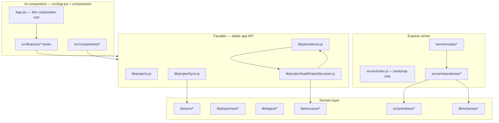

# Canvas Architecture Master Spec

**Version:** 2026-06-02-remediation-v1  
**Status:** Active — update this document as remediation phases land.

This is the single source of truth for target architecture, module boundaries, debugging, and testing after the structural remediation program (Phases 0–6).

---

## 1. System overview



### Layers

| Layer | Path | Responsibility |
|-------|------|----------------|
| UI composition | `src/App.jsx`, `src/features/` | React state wiring; no direct deep `sync/*` imports |
| Facade | `lib/projects.js`, `lib/persistence.js`, `lib/projectSync.js` | Stable exports for app and tests |
| Domain | `lib/sync/`, `lib/placement/`, `lib/ingest/`, `lib/structure/` | Business logic, merge, patch, placement |
| Schemas | `lib/schemas/` | Shared Zod validation at boundaries |
| Server | `server/routes/`, `server/repositories/` | HTTP + Postgres |
| Shared kernel | `src/primitives/`, `lib/sync/projectPatchOps.js` | Used by client and server |

---

## 2. Import boundaries (enforced by convention)

```
UI (App, components, features)
  → lib/projects.js | lib/persistence.js | feature hooks
    → lib/projectSync.js | lib/placement/* | lib/ingest/*
      → lib/sync/*

Server routes
  → server/repositories/*
    → lib/schemas/* | lib/sync/projectPatchOps.js | src/primitives/*
```

**Do not:**
- Import `lib/sync/projectSyncDocument.js` from components
- Add routes to `server/index.js` (use `server/routes/`)
- Write layout to Postgres outside `commitProjectDocument` → `structure/canvasWriteThrough.js`

---

## 3. Feature hooks (`src/features/`)

Extracted from `App.jsx` to reduce the god-component. Each hook owns effects + callbacks for one concern.

| Hook | File | Responsibility |
|------|------|----------------|
| Sync lock | `features/sync/useSyncLockListener.js` | `setSyncLockListener`, banner side-effects |
| SSE streams | `features/sync/useSyncStreams.js` | Project + workspace index SSE |
| Workspace index | `features/sync/useWorkspaceIndexSync.js` | Index refresh, poll, name sync |
| Action sync | `features/sync/useActionSync.js` | `registerActionSyncHandlers`, placement commit |
| Visibility | `features/sync/useVisibilitySync.js` | Tab visible → index refresh + reconcile |
| Page hide | `features/sync/usePageHideFlush.js` | Unload flush coordinator |
| Cache eviction | `features/sync/useProjectCacheEviction.js` | LRU context from index ids |

**Done (Phase 1 continuation):**
- `useProjectSyncLifecycle.js` — boot, background sync, load/switch
- `useFolderLinkScan.js` — folder handle, scan, restore
- `useAgentChatShell.js` — agent panel orchestration

**Done (Phase 1b):**
- `useClusterContext.js` — cluster/inspector/graph, hulls, card selection
- `useCanvasDocument.js` — card CRUD, placement, dock, staging, canvas view
- `useProjectWorkspace.js` — create/switch/archive/delete, `resetProjectUi`

**Done (Phase 1c):**
- `CanvasWorkspaceView.jsx` — loaded-state UI composition (Canvas, chrome, overlays, dialogs, RightDock)

**Done (Phase 2 — thin composition root):**
- `useAppShell.js` — composes all feature hooks; builds bundled `viewProps` for `CanvasWorkspaceView`
- `buildWorkspaceViewBundles.js` — groups props into `workspace`, `folder`, `sync`, `canvas`, `cluster`, `agent`, `dialogs`
- `App.jsx` — loading gate + `<CanvasWorkspaceView {...viewProps} />` only (~18 LOC)

---

## 4. Load and commit authority (Phase 4)

### Load path

All project structure loads go through:

```js
import { loadProjectStructure } from '../lib/project/loadProjectStructure.js';
const doc = await loadProjectStructure(projectId, options);
```

Implementation: `loadProjectStructure` → `loadSyncedProjectDocument` → `applyProjectLoadFence` / `reconcileSpecCanvasOnLoad`.

Server-pull, remote-patch, and document-override hydrate paths call `applyProjectLoadFence` before UI consumption or local cache write.

Fenced call sites:
- `useProjectSyncLifecycle` — `applyServerPullResult`, `loadProjectIntoState` overrides
- `projectSyncDocument.pullProjectDocumentIfServerNewer` — after merge, before IDB write
- `projectSyncRemoteApply.applyRemoteProjectPatchNow` — after patch merge, before IDB write

`loadProjectById` in `persistence.js` is a **deprecated alias** — do not add new callers.

Export from facade: `projects.js` → `loadProjectStructure`, `applyProjectLoadFence`.

### Commit path

All layout/placement commits go through:

```js
import { commitProjectDocument } from '../lib/persistence.js';
await commitProjectDocument(projectId, { state, stagedSyncCards, reason, pushRemote });
```

Side effects: local IndexedDB cache → optional remote PATCH/PUT → `writeThroughSpecCanvasFromPayload`.

Push-only paths (conflict keep-local, boot push) route through `commitProjectDocument` with `pushRemote: true` instead of calling `flushOutgoingProjectDocument` / `pushProjectDocumentIfLocalNewer` directly.

When `commitProjectDocument` pushes, `flushOutgoingProjectDocument` receives `skipSpecDualWrite: true` (commit already write-through). Direct flush callers still dual-write spec when needed.

`saveProjectById` no longer calls `syncSpecCanvasStateFromPayload` — commit write-through is authoritative.

### Legacy (deprecated)

| Module | Status | Replacement |
|--------|--------|-------------|
| `loadProjectById` | **Deprecated** | `loadProjectStructure` |
| `saveProjectById` | **Deprecated** (hygiene/create only) | `commitProjectDocument` + `requestActionSync` |
| Direct `loadSyncedProjectDocument` from UI | **Deprecated** | `loadProjectStructure` |
| Direct layout reads from JSON when spec wins | **Deprecated** | `applyProjectLoadFence` / `reconcileSpecCanvasOnLoad` |
| `projectRevision.js` | Active (local storage keys) | Not to be confused with `sync/projectSyncRevision.js` |

---

## 5. Server routes (Phase 2)

| Router file | Prefix / paths |
|-------------|----------------|
| `routes/health.js` | `GET /health` |
| `routes/canvasProjects.js` | `/canvas/index`, `/canvas/projects/*` |
| `routes/canvasPreviews.js` | `/canvas/previews/*` |
| `routes/canvasAgentChat.js` | `/canvas/agent-chat/*` |
| `routes/spec.js` | `/canvas/projects/:id/spec-*`, `/spec/*` |
| `routes/clusters.js` | `/clusters/*` |
| `routes/artifacts.js` | `/artifacts/*`, `/bookmarks/preview` |
| `routes/primitives.js` | `/primitives/*`, `/relationships/*`, `/notes/*`, `/assertions/*`, `/tasks/*` |
| `routes/agent.js` | `/agent/*` |

`server/index.js` — middleware, DB init, route registration, listen only.

---

## 6. Schema validation (Phase 3)

Shared Zod schemas in `lib/schemas/`:

| Schema | Used at |
|--------|---------|
| `projectPatchOpsSchema` | Client before push; server PATCH handler |
| `projectDocumentSchema` | Optional strict validation on PUT |
| `workspaceIndexSchema` | Index PUT validation |

Run validation via `lib/schemas/validate.js` helpers.

---

## 7. Debugging

### Sync trace

Enable verbose sync logging in browser console:

```js
localStorage.setItem('canvas:sync-trace', '1');
// reload
```

Implementation: `lib/sync/syncTrace.js` — logs patch summaries, reconcile decisions, placement audit steps.

### Placement audit

```js
localStorage.setItem('canvas:placement-audit', '1');
```

Steps logged by `lib/placement/placementAudit.js` during load, commit, transfer.

### Server patch trace

PATCH requests accept `traceId` in body; server logs via `syncTraceLog(traceId, ...)`.

### Common issues

| Symptom | Check |
|---------|-------|
| Stale canvas after edit | `getClientRevision(projectId)` vs server meta; SSE connected? |
| Placements lost on switch | `artifactPlacements` in committed payload; `placement-persistence-qa.md` |
| Index out of sync | `GET /canvas/index/stream`; poll interval |
| Spec vs document drift | `GET /canvas/projects/:id/spec-canvas` vs document revision |
| Local-only mode | `isServerSyncEnabled()` false → footer banner |

### DB inspection

```bash
cd canvas
npm run db:migrate
node scripts/list-db-projects.mjs
```

### Reset workspace DB (dev only)

```bash
node scripts/reset-workspace-db.mjs
```

---

## 8. Testing

### Commands

```bash
cd canvas
npm test                    # full suite (may need memory tuning)
npm run test:sync           # sync-critical subset — CI gate
npm run test:features       # feature hook tests
npm run lint
node scripts/capture-architecture-baseline.mjs
node scripts/verify-project-sync-exports.mjs
```

### CI

`.github/workflows/sync-tests.yml` runs `npm run test:sync` on every push/PR.

### Test tags (Phase 6)

| Tag | Scope |
|-----|-------|
| `@sync-critical` | Patch, merge, placement, actionSync |
| `@integration` | Cross-module persistence |
| `@features` | Extracted React hooks |

### Manual QA

- `docs/P0_MANUAL_CHECKLIST.md` — release smoke
- `docs/placement-persistence-qa.md` — placement scenarios

### Vitest config

- `pool: 'forks'` — avoids OOM on large suites
- `maxWorkers: 2` — limits parallel memory on Windows

---

## 9. Baseline metrics

Captured by `scripts/capture-architecture-baseline.mjs`. Targets after remediation:

| Metric | Baseline (2026-06-02) | Target |
|--------|----------------------|--------|
| `App.jsx` LOC | ~6100 | < 800 |
| Hook calls in App | ~104 | < 20 |
| `server/index.js` LOC | ~1210 | < 150 |
| Deep `sync/*` imports from App | many | 0 |
| Test files | ~115 | growing |

---

## 10. Remediation progress

| Phase | Description | Status |
|-------|-------------|--------|
| P0 | Master spec, README, CI, baseline script | **Done** |
| P1 | Extract feature hooks + workspace view from App.jsx | **Done** (13 hooks + `CanvasWorkspaceView` + `useAppShell`; App ~18 LOC) |
| P2 | Split server/index.js into routes | **Done** (58 LOC bootstrap) |
| P3 | Zod schemas at sync boundaries | **Done** |
| P4 | Dual-model fence (load/commit authority) | **Done** |
| P5 | Consolidate lib/placement/ | **Done** (barrel module) |
| P6 | Vitest hardening + feature tests | **Done** (singleFork pool) |

### Current metrics (2026-06-03)

| Metric | Baseline | Current | Target |
|--------|----------|---------|--------|
| `App.jsx` LOC | ~6100 | ~18 | < 800 |
| `useAppShell.js` LOC | — | ~889 | — |
| `CanvasWorkspaceView.jsx` LOC | — | ~827 | — |
| `server/index.js` LOC | ~1210 | 58 | < 150 |
| Deep `sync/*` imports from App | many | 0 | 0 |
| Feature hooks extracted | 0 | 13 + `useAppShell` | 10+ |
| Test files | ~115 | 117 | — |

*Run `npm run baseline` to refresh metrics.*

### Phase 1 follow-up — Done

- `useProjectSyncLifecycle.js` — boot, background sync, load/switch
- `useFolderLinkScan.js` — folder handle, scan, restore
- `useAgentChatShell.js` — agent panel orchestration

### Phase 1b — Done

- `useClusterContext.js` — cluster/inspector/graph, hulls, selection
- `useCanvasDocument.js` — card CRUD, placement, dock, staging
- `useProjectWorkspace.js` — project create/switch/archive/delete
- `App.jsx` reduced from ~2890 to ~1346 LOC
- Action-sync callbacks bridged into canvas via refs (canvas hook runs before `useActionSync`)
- `clusterMemberOptionsRef` synced from agent shell after mount

### Phase 1c — Done

- `CanvasWorkspaceView.jsx` — loaded-state JSX (Canvas, MobileView, SyncHoldingTray, CanvasChrome, overlays, dialogs, RightDock, CardModal)
- Derived UI memos moved into view: `folderLinkState`, `folderNeedsConnectUi`, `emptyDesktopHint`, open-card helpers, `clusterSelectionStats`, `closeRightDock`
- `App.jsx` reduced from ~1346 to ~896 LOC (hook wiring + loading spinner only)
- `CanvasWorkspaceView.jsx` ~827 LOC (loaded-state UI composition)

### Phase 2 — Done

- `useAppShell.js` — hook orchestration extracted from `App.jsx`; returns `{ loaded, viewProps }`
- `App.jsx` reduced to ~18 LOC (composition root: loading spinner + view render)
- Meets Phase 1E target: App < 800 LOC, no deep `sync/*` imports

### Phase 4 — Done (dual-model fence)

- **Load authority:** `loadProjectStructure` + `applyProjectLoadFence`; deprecated `loadProjectById`
- **Load fences:** server pull, remote SSE patch apply, document-override hydrate
- **Commit authority:** conflict keep-local and boot push via `commitProjectDocument` + `pushRemote`
- **Spec dedupe:** `skipSpecDualWrite` on flush when called from commit; removed duplicate spec write from `saveProjectById`
- `@deprecated` tags: `loadSyncedProjectDocument`, `saveProjectById`, `loadProjectById`
- Exported via `projects.js`: `loadProjectStructure`, `applyProjectLoadFence`

---

## 11. Related documents

| Document | Purpose |
|----------|---------|
| [PROJECT_SYNC_API.md](./PROJECT_SYNC_API.md) | Frozen `projectSync.js` barrel exports |
| [SPEC_MIGRATION.md](./SPEC_MIGRATION.md) | Spec data plane cutover runbook |
| [placement-persistence-qa.md](./placement-persistence-qa.md) | Placement QA scenarios |
| [P0_MANUAL_CHECKLIST.md](./P0_MANUAL_CHECKLIST.md) | Manual release checklist |
| [structure/README.md](../src/lib/structure/README.md) | Postgres write-through |

---

## 12. Changelog

### 2026-06-03 — Phase 4 dual-model fence complete (implemented)

- Fenced `pullProjectDocumentIfServerNewer` and `applyRemoteProjectPatchNow`
- Conflict keep-local and boot push route through `commitProjectDocument`
- `skipSpecDualWrite` prevents double spec write on commit→flush path
- Removed redundant `syncSpecCanvasStateFromPayload` from `saveProjectById`
- `applyProjectLoadFence` exported via `projects.js` facade

### 2026-06-03 — Phase 4 dual-model fence + prop bundling (implemented)

- `applyProjectLoadFence` on server-pull and document-override hydrate paths
- `loadProjectById` deprecated; `useProjectSyncLifecycle` uses `loadProjectStructure`
- `@deprecated` on `loadSyncedProjectDocument`, `saveProjectById`
- `buildWorkspaceViewBundles.js` groups CanvasWorkspaceView props by feature

### 2026-06-03 — Phase 2 thin composition root (implemented)

- Created `useAppShell.js` in `src/features/workspace/`
- Moved all hook orchestration out of `App.jsx`
- `App.jsx` reduced from ~896 to ~18 LOC
- Export test added for `useAppShell` in `featureHooksExports.test.js`

### 2026-06-03 — Phase 1c workspace view extraction (implemented)

- Created `CanvasWorkspaceView.jsx` in `src/features/workspace/`
- Moved loaded-state UI composition and derived memos out of `App.jsx`
- `App.jsx` reduced from ~1346 to ~896 LOC
- `CanvasWorkspaceView.jsx` ~827 LOC
- Export test added in `featureHooksExports.test.js`

### 2026-06-02 — Phase 1b hook extraction (implemented)

- Created `useClusterContext`, `useCanvasDocument`, `useProjectWorkspace` in `src/features/`
- Integrated into `App.jsx`; reduced from ~2890 to ~1346 LOC
- Deep `sync/*` imports removed from App (0 remaining)
- Export tests extended in `featureHooksExports.test.js`

### 2026-06-02 — Phase 1 hook integration (implemented)

- Integrated `useProjectSyncLifecycle`, `useFolderLinkScan`, and `useAgentChatShell` into `App.jsx`
- `App.jsx` reduced from ~5786 to ~2890 LOC via hook extraction
- Shared refs: `singleConnectorIdRef`, agent thread refs, `refreshClusterApiHealthRef`, `flushPendingPlacementTransferSyncRef`

### 2026-06-02 — remediation-v1 (implemented)

- Created master spec at `docs/ARCHITECTURE_MASTER_SPEC.md`
- Phase 0: README, CI workflow (`.github/workflows/sync-tests.yml`), `scripts/capture-architecture-baseline.mjs`
- Phase 1: Feature hooks in `src/features/sync/` — `useSyncLockListener`, `useSyncStreams`, `useWorkspaceIndexSync`, `useActionSync`, `useVisibilitySync`, `usePageHideFlush`, `useProjectCacheEviction`; App.jsx reduced ~314 LOC
- Phase 2: Server split into `server/routes/*` + `server/lib/http.js`; `index.js` = 58 LOC
- Phase 3: `lib/schemas/projectSyncSchemas.js` (Zod); integrated into `validateProjectPatchOps`
- Phase 4: `lib/project/loadProjectStructure.js` unified load API; exported via `persistence.js` and `projects.js`
- Phase 5: `lib/placement/index.js` barrel for placement domain
- Phase 6: Vitest `singleFork` pool; `npm run test:features`; schema + feature tests added
