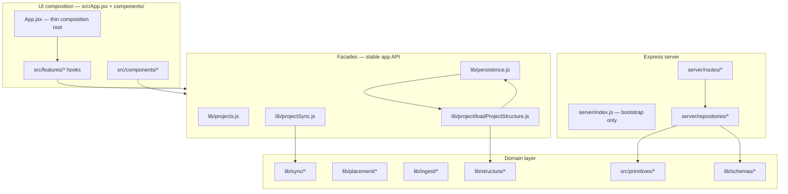
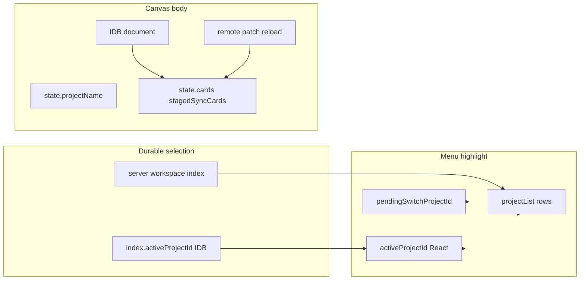

# Canvas Architecture Master Spec

**Version:** 2026-06-14-subfolder-artifacts  
**Status:** Active — this is the single spec authority.

This is the single source of truth for shipped architecture, target data architecture, module boundaries, spec migration, debugging, and testing. Historical runbooks and target-only drafts have been folded into this document.

### Authority model

| Scope | Authority |
|-------|-----------|
| Rendered canvas today | `canvas_project_document` remains authoritative until the spec-read/write cutover gates pass |
| Spec projection today | `spec_canvas_state` and related `spec_*` tables are a secondary projection maintained by dual-write |
| Target structure | Postgres is authoritative for projects, resources, notes, URL links, clusters, relationships, and canvas layout |
| Content blobs | Filesystem stores bytes only; Postgres rows and IDs remain structural truth |
| Client cache | IndexedDB/localStorage are caches and recovery aids, never durable authority |

---

## 1. System overview



### Layers

| Layer | Path | Responsibility |
|-------|------|----------------|
| UI composition | `src/App.jsx`, `src/features/` | React state wiring; no direct deep `sync/*` imports |
| Facade | `lib/projects.js`, `lib/persistence.js`, `lib/projectSync.js` | Stable exports for app and tests |
| Domain | `lib/sync/`, `lib/placement/`, `lib/ingest/`, `lib/structure/` | Business logic, merge, patch, placement |
| Schemas | `lib/schemas/` | Shared Zod validation at boundaries |
| Server | `server/routes/`, `server/repositories/` | HTTP + Postgres |
| Shared kernel | `src/primitives/`, `lib/sync/projectPatchOps.js` | Used by client and server |

---

## 2. Import boundaries (enforced by convention)

```
UI (App, components, features)
  → lib/projects.js | lib/persistence.js | feature hooks
    → lib/projectSync.js | lib/placement/* | lib/ingest/*
      → lib/sync/*

Server routes
  → server/repositories/*
    → lib/schemas/* | lib/sync/projectPatchOps.js | src/primitives/*
```

**Do not:**
- Import `lib/sync/projectSyncDocument.js` from components
- Add routes to `server/index.js` (use `server/routes/`)
- Write layout to Postgres outside `commitProjectDocument` → `structure/canvasWriteThrough.js`

---

## 3. Feature hooks (`src/features/`)

Extracted from `App.jsx` to reduce the god-component. Each hook owns effects + callbacks for one concern.

| Hook | File | Responsibility |
|------|------|----------------|
| Sync lock | `features/sync/useSyncLockListener.js` | `setSyncLockListener`, banner side-effects |
| SSE streams | `features/sync/useSyncStreams.js` | Project + workspace index SSE |
| Workspace index | `features/sync/useWorkspaceIndexSync.js` | Index refresh, poll, name sync |
| Action sync | `features/sync/useActionSync.js` | `registerActionSyncHandlers`, placement commit |
| Visibility | `features/sync/useVisibilitySync.js` | Tab visible → index refresh + reconcile |
| Page hide | `features/sync/usePageHideFlush.js` | Unload flush coordinator |
| Cache eviction | `features/sync/useProjectCacheEviction.js` | LRU context from index ids |

**Done (Phase 1 continuation):**
- `useProjectSyncLifecycle.js` — boot, background sync, load/switch
- `useFolderLinkScan.js` — folder handle, scan, restore
- `useAgentChatShell.js` — agent panel orchestration

**Done (Phase 1b):**
- `useClusterContext.js` — cluster/inspector/graph, hulls, card selection
- `useCanvasDocument.js` — card CRUD, placement, dock, staging, canvas view
- `useProjectWorkspace.js` — create/switch/archive/delete, `resetProjectUi`

**Done (Phase 1c):**
- `CanvasWorkspaceView.jsx` — loaded-state UI composition (Canvas, chrome, overlays, dialogs, RightDock)

**Done (Phase 2 — thin composition root):**
- `useAppShell.js` — composes all feature hooks; builds bundled `viewProps` for `CanvasWorkspaceView`
- `buildWorkspaceViewBundles.js` — groups props into `workspace`, `folder`, `sync`, `canvas`, `cluster`, `agent`, `dialogs`
- `App.jsx` — loading gate + `<CanvasWorkspaceView {...viewProps} />` only (~18 LOC)

---

## 4. Load and commit authority (Phase 4)

### Load path

All project structure loads go through:

```js
import { loadProjectStructure } from '../lib/project/loadProjectStructure.js';
const doc = await loadProjectStructure(projectId, options);
```

Implementation: `loadProjectStructure` → `loadSyncedProjectDocument` → `applyProjectLoadFence` / `reconcileSpecCanvasOnLoad`.

Server-pull, remote-patch, and document-override hydrate paths call `applyProjectLoadFence` before UI consumption or local cache write.

Fenced call sites:
- `useProjectSyncLifecycle` — `applyServerPullResult`, `loadProjectIntoState` overrides
- `projectSyncDocument.pullProjectDocumentIfServerNewer` — after merge, before IDB write
- `projectSyncRemoteApply.applyRemoteProjectPatchNow` — after patch merge, before IDB write

`loadProjectById` in `persistence.js` is a **deprecated alias** — do not add new callers.

Export from facade: `projects.js` → `loadProjectStructure`, `applyProjectLoadFence`.

### Commit path

All layout/placement commits go through:

```js
import { commitProjectDocument } from '../lib/persistence.js';
await commitProjectDocument(projectId, { state, stagedSyncCards, reason, pushRemote });
```

Side effects: local IndexedDB cache → optional remote PATCH/PUT → `writeThroughSpecCanvasFromPayload`.

Push-only paths (conflict keep-local, boot push) route through `commitProjectDocument` with `pushRemote: true` instead of calling `flushOutgoingProjectDocument` / `pushProjectDocumentIfLocalNewer` directly.

When `commitProjectDocument` pushes, `flushOutgoingProjectDocument` receives `skipSpecDualWrite: true` (commit already write-through). Direct flush callers still dual-write spec when needed.

`saveProjectById` no longer calls `syncSpecCanvasStateFromPayload` — commit write-through is authoritative.

### Legacy (deprecated)

| Module | Status | Replacement |
|--------|--------|-------------|
| `loadProjectById` | **Deprecated** | `loadProjectStructure` |
| `saveProjectById` | **Deprecated** (hygiene/create only) | `commitProjectDocument` + `requestActionSync` |
| Direct `loadSyncedProjectDocument` from UI | **Deprecated** | `loadProjectStructure` |
| Direct layout reads from JSON when spec wins | **Deprecated** | `applyProjectLoadFence` / `reconcileSpecCanvasOnLoad` |
| `projectRevision.js` | Active (local storage keys) | Not to be confused with `sync/projectSyncRevision.js` |

---

## 5. Data architecture target

This section is prescriptive for the end-state data model. Where this section says MUST, treat it as a hard rule for new work and for the spec cutover.

### Core principles

1. **Postgres is the source of truth for structure.** Projects, resources, notes, URL links, clusters, their relationships, and canvas layout live in Postgres.
2. **The filesystem is the source of truth for content blobs only.** Resource bodies, note bodies, and chat files are referenced by ID and path metadata from Postgres.
3. **Identity is a UUID, never a file path.** Paths can change; IDs do not.
4. **Resources are shared; notes and URL links are project-specific.** Editing a shared resource updates it everywhere; notes and URL links belong to exactly one project.
5. **Content is never duplicated implicitly.** Resource duplication happens only through an explicit Detach action.
6. **Normal user actions soft-delete.** Resource bytes are purged only when nothing references them and an explicit purge job runs.
7. **Every durable write is tagged with `project_id` where project scope matters.** Stale writes are rejected with optimistic concurrency.

### Identifiers

- Every project, resource, note, URL link, chat, and cluster MUST get a UUID at creation time.
- The ID is generated once, is immutable, and is never reused after delete.
- File paths and sync filenames may be stored as aliases during migration, but MUST NOT become primary identity.

### Filesystem layout

There are two storage locations:

```text
<project_root>/
  notes/
    <note_id>.md
  chats/
    <chat_id>.md
  project.json

<shared_store>/
  resources/
    <resource_id>.<ext>
```

Rules:

- Note and chat blobs live under the project's `root_path` and are project-specific.
- Resource blobs live in the shared store exactly once, regardless of how many projects reference them.
- `notes.file_path` and `chats.file_path` are relative to `projects.root_path`.
- A file with no matching Postgres row is an orphan. Orphan sweeps may remove unmatched shared-resource blobs, but project folders are user-owned and should only be reported, not auto-deleted.

### Target tables

Current migrations use `spec_*` table names while the app migrates. The target model below describes the durable structure those tables converge on.

```sql
CREATE TABLE projects (
  id UUID PRIMARY KEY,
  name TEXT NOT NULL,
  root_path TEXT NOT NULL,
  created_at TIMESTAMPTZ NOT NULL DEFAULT now(),
  updated_at TIMESTAMPTZ NOT NULL DEFAULT now(),
  deleted_at TIMESTAMPTZ,
  version BIGINT NOT NULL DEFAULT 1
);

CREATE TABLE resources (
  id UUID PRIMARY KEY,
  kind TEXT NOT NULL,
  file_path TEXT NOT NULL,
  content_hash TEXT NOT NULL,
  version BIGINT NOT NULL DEFAULT 1,
  created_at TIMESTAMPTZ NOT NULL DEFAULT now(),
  updated_at TIMESTAMPTZ NOT NULL DEFAULT now(),
  deleted_at TIMESTAMPTZ
);

CREATE TABLE project_resources (
  project_id UUID NOT NULL REFERENCES projects(id),
  resource_id UUID NOT NULL REFERENCES resources(id),
  created_at TIMESTAMPTZ NOT NULL DEFAULT now(),
  PRIMARY KEY (project_id, resource_id)
);

CREATE TABLE notes (
  id UUID PRIMARY KEY,
  project_id UUID NOT NULL REFERENCES projects(id),
  title TEXT,
  file_path TEXT NOT NULL,
  version BIGINT NOT NULL DEFAULT 1,
  created_at TIMESTAMPTZ NOT NULL DEFAULT now(),
  updated_at TIMESTAMPTZ NOT NULL DEFAULT now(),
  deleted_at TIMESTAMPTZ
);

CREATE TABLE note_links (
  note_id UUID NOT NULL REFERENCES notes(id),
  resource_id UUID NOT NULL REFERENCES resources(id),
  created_at TIMESTAMPTZ NOT NULL DEFAULT now(),
  PRIMARY KEY (note_id, resource_id)
);

CREATE TABLE url_links (
  id UUID PRIMARY KEY,
  project_id UUID NOT NULL REFERENCES projects(id),
  url TEXT NOT NULL,
  title TEXT,
  description TEXT,
  created_at TIMESTAMPTZ NOT NULL DEFAULT now(),
  updated_at TIMESTAMPTZ NOT NULL DEFAULT now(),
  deleted_at TIMESTAMPTZ
);

CREATE TABLE clusters (
  id UUID PRIMARY KEY,
  project_id UUID NOT NULL REFERENCES projects(id),
  name TEXT NOT NULL,
  created_at TIMESTAMPTZ NOT NULL DEFAULT now(),
  deleted_at TIMESTAMPTZ
);

CREATE TABLE cluster_members (
  cluster_id UUID NOT NULL REFERENCES clusters(id),
  resource_id UUID NOT NULL REFERENCES resources(id),
  PRIMARY KEY (cluster_id, resource_id)
);

CREATE TABLE canvas_state (
  project_id UUID PRIMARY KEY REFERENCES projects(id),
  layout JSONB NOT NULL,
  viewport JSONB NOT NULL,
  version BIGINT NOT NULL DEFAULT 1,
  updated_at TIMESTAMPTZ NOT NULL DEFAULT now()
);

CREATE TABLE chats (
  id UUID PRIMARY KEY,
  project_id UUID NOT NULL REFERENCES projects(id),
  agent_id TEXT NOT NULL,
  file_path TEXT NOT NULL,
  ordering INTEGER NOT NULL,
  created_at TIMESTAMPTZ NOT NULL DEFAULT now(),
  deleted_at TIMESTAMPTZ
);
```

Foreign keys MUST stay enforced. A note may only link to a resource referenced by the same project through `project_resources`.

### Canvas state

Placement is per-project even when content is shared. Placeable node kinds are `resource`, `note`, and `url`; each placed node is identified by `kind` plus `id`.

```json
{
  "placed": [
    { "kind": "resource", "id": "<uuid>", "x": 120, "y": 80, "w": 240, "h": 160, "cluster_id": null },
    { "kind": "note", "id": "<uuid>", "x": 400, "y": 80, "w": 200, "h": 140 },
    { "kind": "url", "id": "<uuid>", "x": 640, "y": 80, "w": 200, "h": 80 }
  ]
}
```

```json
{ "x": 0.0, "y": 0.0, "zoom": 1.0 }
```

- `cluster_id` applies to resource nodes only.
- Connectors from notes to resources are rendered from `note_links`, not stored in layout.
- Selection, hover, and in-flight drag position are React-only view state.
- Persistent canvas changes are debounced and flushed on blur / unload; drag frames are not individually persisted.

### Shared resources and Detach

- Adding a resource to a project inserts `project_resources(project_id, resource_id)` and does not copy bytes.
- Editing a resource writes the new blob, recomputes `content_hash`, updates the resource row with a version check, and becomes visible to other referencing projects on next load.
- Detach is the only implicit-copy escape hatch: mint a new resource ID, copy bytes, insert the new resource row, and in one transaction repoint the current project's project-resource row, canvas placements, cluster membership, and note links.
- The UI should expose the reference count for shared resources.

### Write ordering and deletes

- For rows with file bodies, write the blob first, then insert/update the Postgres row.
- Concurrent resource or note edits use optimistic concurrency and retry once after re-fetch.
- Multi-table operations run in one transaction.
- Removing a resource from a project removes that project's reference, note links, cluster memberships, and canvas placement; shared bytes survive while any project references them.
- Deleting notes, URL links, and projects is soft-delete. Project deletion removes project-specific references without deleting resources still used elsewhere.

### Target API surface

Minimum target endpoints:

```text
POST   /projects
GET    /projects
GET    /projects/:id
DELETE /projects/:id

POST   /resources
GET    /resources/:id
PUT    /resources/:id
DELETE /resources/:id

POST   /projects/:id/resources
DELETE /projects/:id/resources/:rid
POST   /projects/:id/resources/:rid/detach

POST   /projects/:id/notes
GET    /projects/:id/notes
PUT    /notes/:id
DELETE /notes/:id
POST   /notes/:id/links
DELETE /notes/:id/links/:rid

POST   /projects/:id/urls
GET    /projects/:id/urls
PUT    /urls/:id
DELETE /urls/:id

GET    /projects/:id/canvas
PUT    /projects/:id/canvas

POST   /projects/:id/clusters
PUT    /clusters/:id/members

POST   /projects/:id/chats
GET    /projects/:id/chats
```

### Target acceptance criteria

1. Refresh restores the exact canvas layout and viewport for the open project.
2. Switching projects and switching back shows each project's own canvas unchanged.
3. A slow save for Project A that completes after switching to B does not alter B.
4. Editing a shared resource in one project updates another project that references it on next load, without duplicating files.
5. Detaching a resource creates an independent copy and repoints the detaching project's placement, cluster membership, and note links.
6. Deleting a project does not remove resources still referenced by another project.
7. Resource bytes are removed only after no projects reference them and only via purge.
8. Notes and URL links created in one project never appear in another project.
9. Note-resource links persist across refresh and project switch, and connectors render from `note_links`.
10. A note cannot link to a resource its project does not reference.
11. Deleting a note removes its links but leaves linked resources intact.
12. A failed create never leaves a Postgres row pointing at a missing file.
13. Two tabs editing the same resource or note do not silently overwrite each other.
14. The UI shows how many projects reference a shared resource.

### Anti-patterns

- Do not use file paths or filenames as primary identity.
- Do not store canvas state only in localStorage or React state.
- Do not share notes or URL links between projects.
- Do not duplicate resource bytes except through Detach.
- Do not store a resource's position on the resource.
- Do not store note-resource connectors in layout JSON.
- Do not let a note link to a resource its project does not reference.
- Do not delete resource bytes while any project still references them.
- Do not write a DB row before its file is safely on disk.
- Do not hard-delete on normal delete actions.
- Do not save canvas state on every drag frame.
- Do not apply a save response for a project that is no longer active.
- Do not poll for live cross-project resource edits; use a notification channel if live propagation is added.

---

## 6. Spec data plane migration

### Phase 2 (shipped): `artifactPlacements` in project JSON

- **Field:** `artifactPlacements` — map of canonical sync key to `{ surface, record }`
- **Version:** `artifactPlacementsVersion: 1`
- **Load:** `normalizeLoadedProject` → `reconcileArtifactPlacements`; the map is authoritative when present and legacy arrays migrate on first load
- **Save:** `buildProjectSavePayload` → `attachArtifactPlacementsToPayload`
- **Compatibility:** `cards` and `stagedSyncCards` remain in the payload until cutover

### Linked-folder subfolder artifacts (read-only first slice)

Linked folder scans are recursive. Root-level files keep their historical canonical sync keys, while nested files include their normalized relative path so duplicate basenames do not collide:

| Disk path | Canonical sync key |
|-----------|--------------------|
| `notes__site-v1.md` | `notes__site` |
| `refs/notes__site-v1.md` | `refs/notes__site` |
| `refs/archive/notes__site-v1.md` | `refs/archive/notes__site` |

Rules:

- `scanFolderFiles` walks directory handles recursively with stale-scan cancellation, ignored folders (`node_modules`, `.git`, hidden/system folders), max-depth, and max-file limits.
- Folder-backed versions may carry both `filename` (basename) and `relativePath` (normalized path from the linked root). Consumers must resolve file reads through `relativePath` when present.
- Preview cache keys, staging, `folderPresentKeys`, artifact ingest URIs, outbox entries, agent context reads, external open, and stripped-content hydration use the path-aware canonical key.
- App-created notes, bookmarks, and agent chat transcripts still write to the linked-folder root. Nested files are read and staged from subfolders, but app writes into subfolders require a separate explicit create-in-folder flow.
- Dock hover UI may show nested `relativePath` for disambiguation; root files keep the existing label behavior.

### Phase 3 (partial): Postgres spec tables and dual-write

Implemented by `server/migrations/0010_spec_data_plane.sql`:

- `spec_resource`, `spec_project_resource`
- `spec_note`, `spec_url_link`, `spec_note_link`
- `spec_canvas_state` (layout, viewport, version)
- `spec_chat`

Spec routes:

| Method | Path | Purpose |
|--------|------|---------|
| GET | `/canvas/projects/:id/spec-canvas` | Fetch spec layout/viewport |
| PUT | `/canvas/projects/:id/spec-canvas` | Save with `expectedVersion` CAS |
| GET | `/spec/resources/:id` | Resource + reference count |
| POST | `/canvas/projects/:id/spec-resources/:rid/link` | Add project reference |
| POST | `/canvas/projects/:id/spec-resources/:rid/detach` | Detach / repoint reference |
| GET/POST/DELETE | `/spec/notes/:noteId/links` | Note-resource links |

Workspace index realtime: `GET /canvas/index/stream` broadcasts `index_updated` after successful `PUT /canvas/index`, including `clientId` so the origin tab can skip redundant refresh.

Client dual-write:

- **Save:** `writeThroughSpecCanvasFromPayload` runs on every layout/placement commit through `structure/canvasWriteThrough.js`; project document PUT paths can also sync spec state.
- **Load:** `reconcileSpecCanvasOnLoad` applies `spec_canvas_state` when the version matches document revision, when spec-only data exists, or when spec version is at least the document revision. Otherwise project JSON remains authoritative and drift is logged.

Current gaps before the target data architecture is complete:

- Shared resource store on disk under `<shared_store>/resources/`
- `projects.root_path` with `notes/` and `chats/` migration
- UUID-only identity everywhere; filename/sync keys still exist in JSON paths
- Live cross-project resource propagation
- UI reference count from `spec_project_resource`
- Connectors rendered only from `spec_note_link`
- Hard cutover to DB-only layout without full `canvas_project_document`

### Phase 4+ cutover design

Current invariant: `canvas_project_document` remains the rendered-canvas authority. `spec_canvas_state` is a secondary projection until every gate below passes in tests and browser smoke.

1. **Identity and soft-delete foundation**
   - Add `deleted_at`, `deleted_by`, and `delete_reason` to removable project, resource-link, note-link, and canvas-state rows.
   - Keep hard deletes only for cache/blob cleanup tables and test reset scripts.
   - Normalize client-generated IDs at creation boundaries.
   - Store legacy filename/sync keys as aliases, not primary identity.
   - Gate: deleting a project removes it from `canvas_workspace_index` and marks server rows deleted without allowing stale local caches to recreate the row.

2. **Shared resource store**
   - Use content hash plus UUID: hash dedupes bytes; UUID remains app-facing identity.
   - Store bytes under `<shared_store>/resources/<sha256-prefix>/<sha256>` for large blobs.
   - Project membership lives in `spec_project_resource(project_id, resource_id, role, created_at, deleted_at)`.
   - Gate: importing the same file into two projects creates one resource row and two project-resource rows; deleting one project leaves the resource available to the other.

3. **DB-only canvas state shadow mode**
   - Extend `spec_canvas_state.layout` to render card placement, staging placement, and artifact placement map entries.
   - On every `commitProjectDocument`, dual-write project JSON and spec layout with CAS; retry once and enqueue outbox on remaining conflict.
   - Add a diagnostic loader that builds a project payload from `spec_canvas_state` and compares it to `canvas_project_document`.
   - Gate: JSON -> spec -> JSON round-trip tests cover canvas cards, staging cards, viewport, and artifact placements.

4. **Read cutover**
   - Feature flag: `canvas-spec-layout-read=1`.
   - `loadProjectStructure` reads `spec_canvas_state` first behind the flag, then falls back to project JSON if spec is missing or stale.
   - SSE remains notification-only; clients still validate `version` / `revision` before applying data.
   - Rollback: disable the flag and keep project JSON writes active.
   - Gate: browser smoke passes project switch, placement, refresh, and rapid switch with spec-read enabled.

5. **Write cutover**
   - `commitProjectDocument` writes `spec_canvas_state` as the primary command and writes a slim `canvas_project_document` snapshot only for rollback/export.
   - CAS authority moves from document `revision` to spec `version` for layout changes. Project metadata keeps its own workspace index revision.
   - Gate: stale layout writes conflict on `spec_canvas_state.version` and cannot overwrite newer card positions.

6. **Cleanup and compatibility removal**
   - Stop writing full layout arrays to `canvas_project_document`.
   - Remove legacy localStorage project-body recovery for spec-read clients after a migration window.
   - Keep export/import support by generating the old JSON shape from spec rows.
   - Gate: reset, delete-all-projects, and browser reconnect cannot resurrect projects from old local caches.

### Required gates before cutover

- `npm run test:sync` covers project sync, project CRUD, route/SSE, Postgres CAS, IndexedDB cache, and spec dual-write tests.
- Add browser smoke with `canvas-spec-layout-read=1` before enabling spec-read by default.
- Add a Postgres-backed test that creates one shared resource, links it to two projects, soft-deletes one project, and verifies the resource remains linked to the other.
- Add migration idempotence tests: running the backfill twice produces the same row counts and no duplicate aliases.
- Add rollback test: after spec-read is disabled, the project still loads from `canvas_project_document`.

### Applying migrations

```bash
cd canvas
npm run db:migrate
```

### Interim document revision sync

Until layout is fully authoritative in `spec_canvas_state`, the client keeps `canvas_project_document.revision` in sync via:

- `reconcileActiveProject` on poll, visibility resume, and project switch; it adopts revision when payloads match and pushes or pulls otherwise
- `seedClientRevisionFromMeta` after cache-first project load
- automatic revision healing instead of a blocking stale-tab state when possible

### Migration verification

1. Verify dock-only chats do not trigger repeat sync modals and do not create canvas+dock duplicates.
2. Save a project and inspect JSON for `artifactPlacements`.
3. With API and Postgres up, `GET /canvas/projects/{id}/spec-canvas` returns layout mirroring cards/staging.

---

## 7. Server routes (Phase 2)

| Router file | Prefix / paths |
|-------------|----------------|
| `routes/health.js` | `GET /health` |
| `routes/canvasProjects.js` | `/canvas/index`, `/canvas/projects/*` |
| `routes/canvasPreviews.js` | `/canvas/previews/*` |
| `routes/canvasAgentChat.js` | `/canvas/agent-chat/*` |
| `routes/spec.js` | `/canvas/projects/:id/spec-*`, `/spec/*` |
| `routes/clusters.js` | `/clusters/*` |
| `routes/artifacts.js` | `/artifacts/*`, `/bookmarks/preview` |
| `routes/primitives.js` | `/primitives/*`, `/relationships/*`, `/notes/*`, `/assertions/*`, `/tasks/*` |
| `routes/agent.js` | `/agent/*` |

`server/index.js` — middleware, DB init, route registration, listen only.

---

## 8. Schema validation (Phase 3)

Shared Zod schemas in `lib/schemas/`:

| Schema | Used at |
|--------|---------|
| `projectPatchOpsSchema` | Client before push; server PATCH handler |
| `projectDocumentSchema` | Optional strict validation on PUT |
| `workspaceIndexSchema` | Index PUT validation |

Run validation via `lib/schemas/validate.js` helpers.

---

## 9. Debugging

See **[DEBUGGING_GUIDE.md](DEBUGGING_GUIDE.md)** for the full system map, per-flow trace stages, and symptom tables.

### Sync trace

Enable verbose sync logging in browser console:

```js
localStorage.setItem('canvas-sync-trace', '1');
// reload (legacy alias: canvas:sync-trace)
```

Implementation: `lib/sync/syncTrace.js` — logs patch summaries, reconcile decisions, flow stages (`project:create`, `project:switch`, etc.). See [DEBUGGING_GUIDE.md](DEBUGGING_GUIDE.md).

### Placement audit

```js
localStorage.setItem('canvas-placement-audit', '1');
// legacy alias: canvas:placement-audit
```

Steps logged by `lib/placement/placementAudit.js` during load, commit, transfer.

### Server patch trace

PATCH requests accept `traceId` in body; server logs via `syncTraceLog(traceId, ...)`.

### Menu / canvas / database drift

Selection and canvas are **multiple projections**, not one React field. When the menu checkmark, header title, and canvas cards disagree, trace which layers updated.



| Layer | Location | Drives |
|-------|----------|--------|
| `pendingSwitchProjectId` | `useAppShell` | Menu highlight during switch |
| `activeProjectId` | `useAppShell` | Committed selection after successful load |
| `activeProjectIdRef` | `useAppShell` | `shouldApplyProjectLoad`, switch guards |
| Index `activeProjectId` | `lib/projects.js` / IDB | Boot + `persistActiveProjectId` |
| Server index | Postgres + SSE `index_updated` | Cross-browser project list |
| `projectList` | `useAppShell` | `ProjectSwitcher` rows |
| `state` / `loadProjectIntoState` | `useProjectSyncLifecycle` | Canvas cards |
| Header display | `resolveHeaderProjectName` in `CanvasWorkspaceView` | Header `textbox` (menu row when not dirty) |

**Workspace projection (Phase 2):** [`useWorkspaceProjection.js`](../src/features/workspace/useWorkspaceProjection.js) is the single coordinator for selection lifecycle. Consumers read `workspaceProjection` from `buildWorkspaceViewBundles` (not scattered `??` in the view).

| Field | Meaning |
|-------|---------|
| `effectiveProjectId` | `pending ?? committed` — menu, header, canvas target during switch |
| `committedProjectId` | React `activeProjectId` after successful load |
| `phase` | `idle` \| `selecting` \| `ready` \| `noProjects` |
| `canMutateCanvas` | I6 — blocks placement while switching |

**Transitions:** `selectProject(targetId)` (outgoing commit → load → persist), `commitBoot` / `commitBootWithRecovery` (cold start via `resolveInitialProjectId.js`). Boot rehydrate repairs **same** id only; no second `findBestProjectIdWithLocalCanvas` pass.

**Empty UX:** `noProjects` → create prompt; projects exist but `committedProjectId == null` → select-project prompt (`SelectProjectPrompt.jsx`).

**Agent trace checklist** (see also [`AGENTS.md`](../AGENTS.md)):

1. **Cursor browser:** `http://localhost:5173` — `browser_navigate` → `lock` → `snapshot` → switch project → assert menu checkmark row === header `textbox` name (I1).
2. Enable `canvas-sync-trace` and reproduce.
3. Fill a step table: file/function → input → output → `projectId` → `revision` / `switchSeq`.
4. Note whether `loadProjectIntoState` returned `null` (`shouldApplyProjectLoad` / superseded switch).
5. On switch failure, confirm `restoreWorkspaceProject(previousId)` ran only when `switchStillCurrent`.
6. Dev: `window.__canvasProjectionSnapshot()` for projection fields.
7. Run `npm run test:sync` after fixes.

**Pure invariant helpers:** `src/lib/syncProjectionInvariants.js` — includes `resolveHeaderProjectName` (I1 menu/header alignment); tested in `syncProjectionInvariants.test.js`.

### Common issues

| Symptom | Check |
|---------|-------|
| Menu shows FROG, canvas TREE STORM | Selection layers table above; failed switch without reload? `pending` cleared in `finally`? |
| Stale canvas after edit | `getClientRevision(projectId)` vs server meta; SSE connected? |
| Placements lost on switch | `artifactPlacements` in committed payload; `placement-persistence-qa.md` |
| Dock→canvas reverts on refresh | `placement-persistence-qa.md` § Placement commit debug; `canvas-sync-trace` + `__canvasProjectionSnapshot` + `__canvasDocumentSnapshot`; look for `placement:commit-deferred` / missing `commit:done` |
| Index out of sync | `GET /canvas/index/stream`; poll interval |
| Spec vs document drift | `GET /canvas/projects/:id/spec-canvas` vs document revision |
| Local-only mode | `isServerSyncEnabled()` false → footer banner |

### DB inspection

```bash
cd canvas
npm run db:migrate
node scripts/list-db-projects.mjs
```

### Reset workspace DB (dev only)

```bash
node scripts/reset-workspace-db.mjs
```

---

## 10. Testing

### Commands

```bash
cd canvas
npm test                    # full suite (may need memory tuning)
npm run test:sync           # sync-critical subset — CI gate
npm run test:features       # feature hook tests
npm run lint
node scripts/capture-architecture-baseline.mjs
node scripts/verify-project-sync-exports.mjs
```

### CI

`.github/workflows/sync-tests.yml` runs `npm run test:sync` on every push/PR.

### Test tags (Phase 6)

| Tag | Scope |
|-----|-------|
| `@sync-critical` | Patch, merge, placement, actionSync |
| `@integration` | Cross-module persistence |
| `@features` | Extracted React hooks |

### Manual QA

- `docs/P0_MANUAL_CHECKLIST.md` — release smoke
- `docs/placement-persistence-qa.md` — placement scenarios

### Vitest config

- `pool: 'forks'` — avoids OOM on large suites
- `maxWorkers: 2` — limits parallel memory on Windows

---

## 11. Baseline metrics

Captured by `scripts/capture-architecture-baseline.mjs`. Targets after remediation:

| Metric | Baseline (2026-06-02) | Target |
|--------|----------------------|--------|
| `App.jsx` LOC | ~6100 | < 800 |
| Hook calls in App | ~104 | < 20 |
| `server/index.js` LOC | ~1210 | < 150 |
| Deep `sync/*` imports from App | many | 0 |
| Test files | ~115 | growing |

---

## 12. Remediation progress

| Phase | Description | Status |
|-------|-------------|--------|
| P0 | Master spec, README, CI, baseline script | **Done** |
| P1 | Extract feature hooks + workspace view from App.jsx | **Done** (13 hooks + `CanvasWorkspaceView` + `useAppShell`; App ~18 LOC) |
| P2 | Split server/index.js into routes | **Done** (58 LOC bootstrap) |
| P3 | Zod schemas at sync boundaries | **Done** |
| P4 | Dual-model fence (load/commit authority) | **Done** |
| P5 | Consolidate lib/placement/ | **Done** (barrel module) |
| P6 | Vitest hardening + feature tests | **Done** (singleFork pool) |

### Current metrics (2026-06-03)

| Metric | Baseline | Current | Target |
|--------|----------|---------|--------|
| `App.jsx` LOC | ~6100 | ~18 | < 800 |
| `useAppShell.js` LOC | — | ~889 | — |
| `CanvasWorkspaceView.jsx` LOC | — | ~827 | — |
| `server/index.js` LOC | ~1210 | 58 | < 150 |
| Deep `sync/*` imports from App | many | 0 | 0 |
| Feature hooks extracted | 0 | 13 + `useAppShell` | 10+ |
| Test files | ~115 | 117 | — |

*Run `npm run baseline` to refresh metrics.*

### Phase 1 follow-up — Done

- `useProjectSyncLifecycle.js` — boot, background sync, load/switch
- `useFolderLinkScan.js` — folder handle, scan, restore
- `useAgentChatShell.js` — agent panel orchestration

### Phase 1b — Done

- `useClusterContext.js` — cluster/inspector/graph, hulls, selection
- `useCanvasDocument.js` — card CRUD, placement, dock, staging
- `useProjectWorkspace.js` — project create/switch/archive/delete
- `App.jsx` reduced from ~2890 to ~1346 LOC
- Action-sync callbacks bridged into canvas via refs (canvas hook runs before `useActionSync`)
- `clusterMemberOptionsRef` synced from agent shell after mount

### Phase 1c — Done

- `CanvasWorkspaceView.jsx` — loaded-state JSX (Canvas, MobileView, SyncHoldingTray, CanvasChrome, overlays, dialogs, RightDock, CardModal)
- Derived UI memos moved into view: `folderLinkState`, `folderNeedsConnectUi`, `emptyDesktopHint`, open-card helpers, `clusterSelectionStats`, `closeRightDock`
- `App.jsx` reduced from ~1346 to ~896 LOC (hook wiring + loading spinner only)
- `CanvasWorkspaceView.jsx` ~827 LOC (loaded-state UI composition)

### Phase 2 — Done

- `useAppShell.js` — hook orchestration extracted from `App.jsx`; returns `{ loaded, viewProps }`
- `App.jsx` reduced to ~18 LOC (composition root: loading spinner + view render)
- Meets Phase 1E target: App < 800 LOC, no deep `sync/*` imports

### Phase 4 — Done (dual-model fence)

- **Load authority:** `loadProjectStructure` + `applyProjectLoadFence`; deprecated `loadProjectById`
- **Load fences:** server pull, remote SSE patch apply, document-override hydrate
- **Commit authority:** conflict keep-local and boot push via `commitProjectDocument` + `pushRemote`
- **Spec dedupe:** `skipSpecDualWrite` on flush when called from commit; removed duplicate spec write from `saveProjectById`
- `@deprecated` tags: `loadSyncedProjectDocument`, `saveProjectById`, `loadProjectById`
- Exported via `projects.js`: `loadProjectStructure`, `applyProjectLoadFence`

---

## 13. Related documents

| Document | Purpose |
|----------|---------|
| [PROJECT_SYNC_API.md](./PROJECT_SYNC_API.md) | Frozen `projectSync.js` barrel exports |
| [placement-persistence-qa.md](./placement-persistence-qa.md) | Placement QA scenarios |
| [P0_MANUAL_CHECKLIST.md](./P0_MANUAL_CHECKLIST.md) | Manual release checklist |
| [structure/README.md](../src/lib/structure/README.md) | Postgres write-through |

---

## 14. Changelog

### 2026-06-14 — Linked-folder subfolder artifacts (implemented)

- Added recursive linked-folder scans with path-aware canonical sync keys.
- Preserved root-file key compatibility while using `relativePath` for nested artifact reads, previews, ingest, staging, and agent context.
- Kept app-created notes, bookmarks, and agent chat transcript writes at the linked-folder root for the first subfolder slice.

### 2026-06-14 — Spec consolidation (implemented)

- Folded the target data architecture spec and spec migration runbook into this master spec.
- Clarified current `canvas_project_document` authority versus target Postgres structure authority.
- Retired duplicate spec documents so this file is the only spec authority.

### 2026-06-03 — Phase 4 dual-model fence complete (implemented)

- Fenced `pullProjectDocumentIfServerNewer` and `applyRemoteProjectPatchNow`
- Conflict keep-local and boot push route through `commitProjectDocument`
- `skipSpecDualWrite` prevents double spec write on commit→flush path
- Removed redundant `syncSpecCanvasStateFromPayload` from `saveProjectById`
- `applyProjectLoadFence` exported via `projects.js` facade

### 2026-06-03 — Phase 4 dual-model fence + prop bundling (implemented)

- `applyProjectLoadFence` on server-pull and document-override hydrate paths
- `loadProjectById` deprecated; `useProjectSyncLifecycle` uses `loadProjectStructure`
- `@deprecated` on `loadSyncedProjectDocument`, `saveProjectById`
- `buildWorkspaceViewBundles.js` groups CanvasWorkspaceView props by feature

### 2026-06-03 — Phase 2 thin composition root (implemented)

- Created `useAppShell.js` in `src/features/workspace/`
- Moved all hook orchestration out of `App.jsx`
- `App.jsx` reduced from ~896 to ~18 LOC
- Export test added for `useAppShell` in `featureHooksExports.test.js`

### 2026-06-03 — Phase 1c workspace view extraction (implemented)

- Created `CanvasWorkspaceView.jsx` in `src/features/workspace/`
- Moved loaded-state UI composition and derived memos out of `App.jsx`
- `App.jsx` reduced from ~1346 to ~896 LOC
- `CanvasWorkspaceView.jsx` ~827 LOC
- Export test added in `featureHooksExports.test.js`

### 2026-06-02 — Phase 1b hook extraction (implemented)

- Created `useClusterContext`, `useCanvasDocument`, `useProjectWorkspace` in `src/features/`
- Integrated into `App.jsx`; reduced from ~2890 to ~1346 LOC
- Deep `sync/*` imports removed from App (0 remaining)
- Export tests extended in `featureHooksExports.test.js`

### 2026-06-02 — Phase 1 hook integration (implemented)

- Integrated `useProjectSyncLifecycle`, `useFolderLinkScan`, and `useAgentChatShell` into `App.jsx`
- `App.jsx` reduced from ~5786 to ~2890 LOC via hook extraction
- Shared refs: `singleConnectorIdRef`, agent thread refs, `refreshClusterApiHealthRef`, `flushPendingPlacementTransferSyncRef`

### 2026-06-02 — remediation-v1 (implemented)

- Created master spec at `docs/ARCHITECTURE_MASTER_SPEC.md`
- Phase 0: README, CI workflow (`.github/workflows/sync-tests.yml`), `scripts/capture-architecture-baseline.mjs`
- Phase 1: Feature hooks in `src/features/sync/` — `useSyncLockListener`, `useSyncStreams`, `useWorkspaceIndexSync`, `useActionSync`, `useVisibilitySync`, `usePageHideFlush`, `useProjectCacheEviction`; App.jsx reduced ~314 LOC
- Phase 2: Server split into `server/routes/*` + `server/lib/http.js`; `index.js` = 58 LOC
- Phase 3: `lib/schemas/projectSyncSchemas.js` (Zod); integrated into `validateProjectPatchOps`
- Phase 4: `lib/project/loadProjectStructure.js` unified load API; exported via `persistence.js` and `projects.js`
- Phase 5: `lib/placement/index.js` barrel for placement domain
- Phase 6: Vitest `singleFork` pool; `npm run test:features`; schema + feature tests added
